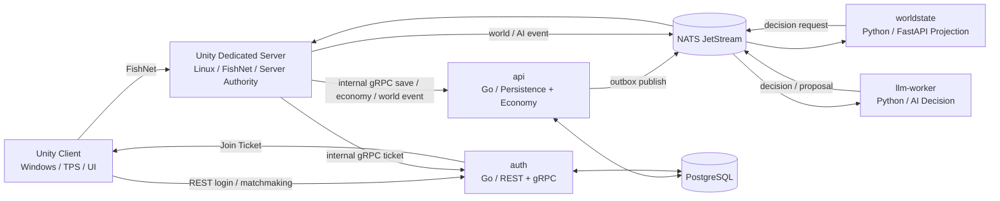

# Living World Survival

Unity Dedicated Server と Go/Python バックエンドで構成する、永続型 3D サバイバルゲームの MVP 実装リポジトリです。プレイヤーは 3D 三人称視点で採掘、製作、狩猟、料理、清掃、Buyer との経済活動を行い、同じワールド内では AI アクターが PersonalState と WorldState に基づいて非同期に行動します。

ルートのこの README はプロジェクト全体の入口です。バックエンドの細かい運用手順は [README_backend.md](README_backend.md)、ゲーム仕様と設計判断は [docs/01_基本設計書_v0.2.1.md](docs/01_基本設計書_v0.2.1.md) と [docs/02_MVP詳細設計書_v0.2.2.md](docs/02_MVP詳細設計書_v0.2.2.md) を参照してください。

## 目的とスコープ

MVP の目的は、以下の縦切りが一つの小規模ワールドで連動することを検証することです。

- Windows Unity Client から Auth/Matchmaking を経由して Linux Dedicated Server へ接続する。
- FishNet ベースの Dedicated Server が移動、Interaction、Inventory、Survival、AI、World Event の権威を持つ。
- PostgreSQL と NATS JetStream を使って、重要状態の永続化、イベント投影、LLM 判断要求を分離する。
- 採掘、製作、狩猟、料理、ゴミ生成、清掃、有限在庫 Buyer、資産ランキングまでを最小ループとして成立させる。
- Blender Python によるモジュラーアセット生成と Unity import の契約を CI で検査する。

現時点の作業履歴は [production/session-state/active.md](production/session-state/active.md) に集約されています。各実装 story と検証記録は `docs/prompts/story_*/` 配下にあります。

## 全体構成



## 技術スタック

| 領域 | 技術 |
|---|---|
| Unity Client / Dedicated Server | Unity `6000.5.3f1`, URP, FishNet, Input System, R3, UniTask, VContainer |
| Auth / Matchmaking | Go 1.22, REST, internal gRPC, JWT, Refresh Token, Join Ticket |
| API / Batch | Go 1.22, gRPC, PostgreSQL, NATS outbox relay, Economy, Ranking |
| WorldState | Python 3.11, FastAPI, asyncpg, nats-py, Prometheus metrics |
| LLM Worker | Python 3.11, nats-py, Anthropic SDK, Pydantic structured output, mock mode |
| 非同期基盤 | NATS JetStream |
| DB | PostgreSQL 16 |
| IDL | Protobuf + buf |
| アセット生成 | Blender Python, glTF/GLB, manifest validation |
| ローカル開発 | Docker Compose, Make, mise, uv, golangci-lint, ruff, pre-commit |

## ディレクトリ

| パス | 内容 |
|---|---|
| `unity/SurvivalWorld/` | Unity Client / Dedicated Server プロジェクト |
| `services/auth/` | Auth / Matchmaking Go サービス |
| `services/api/` | 永続化、WorldData、ActorState、Economy、WorldEvent、Ranking の Go サービス |
| `services/common/` | Go 共通ライブラリ。ログ、metrics、rate limit など |
| `services/worldstate/` | WorldState projection と ActionTemplate 配信の FastAPI サービス |
| `services/llm-worker/` | AI ActionDecision と World Event Proposal を返す NATS worker |
| `services/gen/` | buf で生成される Go/Python protobuf/gRPC 出力 |
| `services/tools/` | load / recovery 用 Go ハーネス |
| `proto/` | `survival/v1/*.proto` と buf 設定 |
| `infra/` | Docker Compose、NATS 設定、RC override |
| `assets-pipeline/` | Blender アセット生成と manifest 検査 |
| `scripts/` | WSL2/Windows の CI、Unity build、smoke、hardening スクリプト |
| `docs/` | 基本設計、MVP 詳細設計、story 実装指示・検証記録 |
| `production/session-state/` | 直近作業状態の引き継ぎメモ |

## 前提環境

### WSL2 / Linux 側

バックエンド、proto、Docker Compose、Python/Go CI は WSL2 側で実行する想定です。

- Docker Desktop with WSL Integration
- `git`, `git-lfs`, `make`
- Go `1.22`
- Python `3.11`
- `uv`
- `buf`
- `migrate` (`golang-migrate`)
- 任意: `mise`, `golangci-lint`, `ruff`, `pre-commit`, `blender`

推奨は `mise.toml` での版固定です。

```bash
mise trust
mise install
eval "$(mise activate bash)"
```

### Windows / Unity 側

Unity Editor と Client / Dedicated Server のビルドは Windows 側で実行する想定です。

- Unity `6000.5.3f1`
- Windows build support
- Linux Dedicated Server build support
- PowerShell
- 必要に応じて `UNITY_EXE` 環境変数

既定の Unity パスは各 PowerShell スクリプトで `C:\Program Files\Unity\Hub\Editor\6000.5.3f1\Editor\Unity.exe` です。別パスの場合は `-Unity` または `UNITY_EXE` を指定してください。

## クイックスタート

WSL2 側でバックエンド環境を起動します。

```bash
git lfs install
cp .env.example .env
make bootstrap
make up
make migrate
make smoke
```

`make smoke` は Docker Compose で全サービスを起動し、各サービスの `/healthz`、`/readyz`、`/metrics` と Auth/Matchmaking E2E を確認します。

ローカル CI だけを回す場合は次を使います。

```bash
make ci
```

`make ci` は proto drift、Go/Python lint、Go/Python test、assets、security を実行します。Blender が無い環境では assets 生成はスキップされます。

## ローカルサービス

開発用 compose は [infra/docker-compose.yml](infra/docker-compose.yml) です。

| サービス | 用途 | ポート |
|---|---|---|
| `postgres` | 永続化 DB | `5432` |
| `nats` | JetStream / monitoring | `4222`, `8222` |
| `auth` | REST health / Client API | `8081` |
| `auth` | internal Matchmaking gRPC | `9091` |
| `api` | HTTP health / admin | `8082` |
| `api` | internal WorldData / ActorState / Economy gRPC | `8092` |
| `worldstate` | FastAPI projection / templates | `8083` |
| `llm-worker` | health / metrics | `8084` |

共通 health endpoint:

- `/healthz`: liveness
- `/readyz`: PostgreSQL / NATS など依存先込みの readiness
- `/metrics`: Prometheus exposition

## 主要コマンド

| コマンド | 内容 |
|---|---|
| `make help` | Make target 一覧 |
| `make bootstrap` | 必須ツール確認 |
| `make up` | PostgreSQL / NATS 起動 |
| `make down` | コンテナ停止と DS プロセス停止 |
| `make migrate` | auth / api の DB migration 適用 |
| `make proto` | buf lint / generate / drift 検査 |
| `make lint` | Go / Python lint |
| `make test` | Go / Python test |
| `make build` | Docker service build |
| `make assets` | Blender asset generate + validate |
| `make smoke` | 全サービス起動 + health / ready / metrics + Auth E2E |
| `make e2e-m2` | Inventory / Save 系の手動 E2E smoke |
| `make e2e-m6` | Buyer / Economy 系の手動 E2E smoke |
| `make security` | M7 security gate |
| `make recovery` | 再起動復旧シナリオ |
| `make load` | ローカル負荷試験 |
| `make load-at020` | AT-020 目標スケール負荷試験 |
| `make soak-short` | 短縮 soak |
| `make soak-full` | 既定 4 時間 soak |
| `make ci-hardening` | security + recovery + load |
| `make reports` | `build/reports/` の最新レポート一覧 |
| `make logs` | Compose サービスログ |

## Unity 作業

Unity プロジェクトは `unity/SurvivalWorld/` です。主要 scene は `Assets/Scenes/Bootstrap.unity` と `Assets/Scenes/World_MVP.unity` です。

Windows PowerShell で実行します。

```powershell
.\scripts\unity_test.ps1
.\scripts\unity_build_client.ps1
.\scripts\unity_build_server.ps1
.\scripts\unity_import_assets.ps1
```

出力先:

- Windows Client: `unity/SurvivalWorld/Build/Client/survival.exe`
- Linux Dedicated Server: `unity/SurvivalWorld/Build/Server/survival-server.x86_64`
- Unity test logs: `unity/SurvivalWorld/Logs/`
- Unity test results: `unity/SurvivalWorld/results-editmode.xml`, `unity/SurvivalWorld/results-playmode.xml`

Dedicated Server の Linux 実行確認では、直近の運用メモに従い WSL distro `Ubuntu-26.04` を使ってください。

## Proto / 生成物

Protobuf の正本は `proto/survival/v1/*.proto` です。

```bash
make proto
```

生成先:

- Go: `services/gen/go/`
- Python: `services/gen/python/`
- C#: `unity/SurvivalWorld/Assets/Generated/`

proto を変更したら生成物の差分もコミットしてください。`make proto` は tracking file と untracked file の両方で drift を検出します。

## アセットパイプライン

`assets-pipeline/generate.py` は Blender headless で mine / camp / production / buyer / nature のモジュラーアセットを生成し、`assets-pipeline/validate.py` が manifest を検査します。

WSL2 / Linux:

```bash
make assets
make assets BLENDER=blender.exe
```

Windows:

```powershell
.\scripts\assets.ps1
.\scripts\assets.ps1 -Seed 1 -ModuleSize 4 -Out build/assets
.\scripts\assets.ps1 -Blender "C:\Program Files\Blender Foundation\Blender 4.5\blender.exe"
```

検査内容は socket、`UCX_` collider 命名、negative scale、non-manifold、Kit 別 triangle budget、LOD、GLB 存在です。Unity への import は `.\scripts\unity_import_assets.ps1` で行います。

## 環境変数

開発用:

```bash
cp .env.example .env
```

RC 用:

```bash
cp .env.rc.example .env.rc
docker compose -f infra/docker-compose.yml -f infra/docker-compose.rc.yml up -d
```

`.env` と `.env.rc` は gitignore 済みです。実 secret、Anthropic API key、RC 用 JWT / Join Ticket key、gRPC shared secret はリポジトリに保存しないでください。

開発用の `LLM_MOCK=1` は決定的モックを使います。実 LLM 経路を使う場合は `LLM_MOCK=0` と `ANTHROPIC_API_KEY` を設定します。

RC compose override は Client から API / WorldState / LLM Worker / PostgreSQL / NATS へ直接到達できない構成にし、外部公開を Auth REST に限定します。RC 用 image tag は `infra/docker-compose.rc.yml` の定義に合わせて事前に用意してください。

## テストと CI

GitHub Actions:

- `.github/workflows/ci.yml`: proto、lint、test、assets、security
- `.github/workflows/nightly.yml`: security、recovery、AT-020 load、soak、report artifact

ローカルで主に使う検証:

```bash
make ci
make smoke
make ci-hardening
```

Unity 側:

```powershell
.\scripts\unity_test.ps1
.\scripts\unity_build_client.ps1
.\scripts\unity_build_server.ps1
```

## 実装上の重要ルール

- Go は `1.22` 固定です。`go.mod` の `go 1.22` と既存依存バージョンを不用意に上げないでください。
- `.sh` は LF 固定です。CRLF になると WSL2 で `bad interpreter` になります。
- `scripts/assets.ps1` は Windows PowerShell 5.1 対策のため ASCII only + UTF-8 BOM + CRLF を維持してください。
- proto 変更時は `services/gen/` と `unity/SurvivalWorld/Assets/Generated/` の生成物を必ず確認してください。
- Unity の自動生成 / import 結果と手作業の prefab 変更を混ぜる場合は、既存 `.meta` と GUID を壊さないようにしてください。
- Client は表示と入力の投影であり、重要ゲーム状態の正本ではありません。正本は Dedicated Server / API / PostgreSQL 側に置きます。
- API / WorldState / LLM Worker は Client 公開面にしません。Client が直接接続するのは Auth/Matchmaking と Dedicated Server だけです。

## ドキュメントの入口

| 文書 | 用途 |
|---|---|
| [docs/01_基本設計書_v0.2.1.md](docs/01_基本設計書_v0.2.1.md) | 全体アーキテクチャ、責任境界、データ権威、ドメイン設計 |
| [docs/02_MVP詳細設計書_v0.2.2.md](docs/02_MVP詳細設計書_v0.2.2.md) | MVP スコープ、詳細仕様、受入条件、要件トレース |
| [README_backend.md](README_backend.md) | WSL2 バックエンド詳細、M7 hardening、注意点 |
| `docs/prompts/story_*/` | story ごとの実装指示、実装ログ、検証 evidence |
| [production/session-state/active.md](production/session-state/active.md) | 直近作業状態の引き継ぎ |

## ライセンス

このリポジトリには現時点でライセンスファイルが配置されていません。
