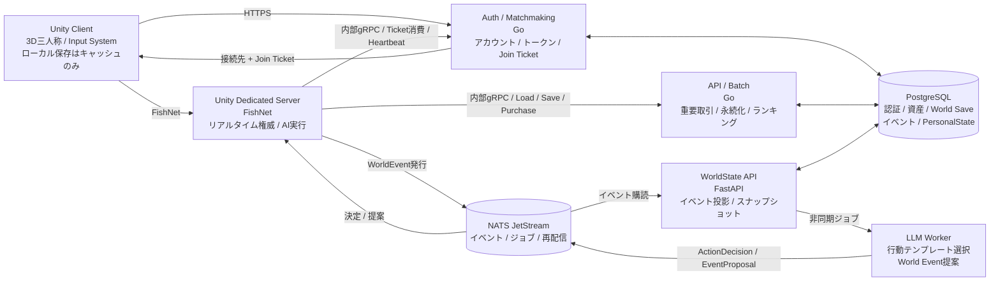
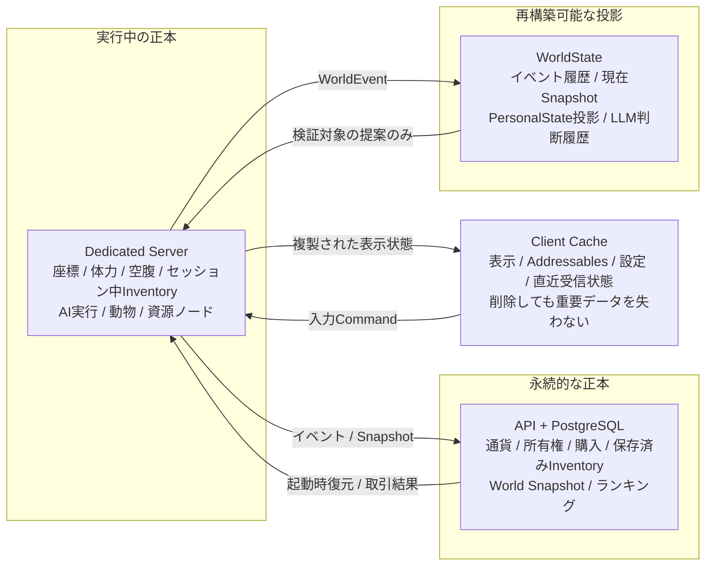
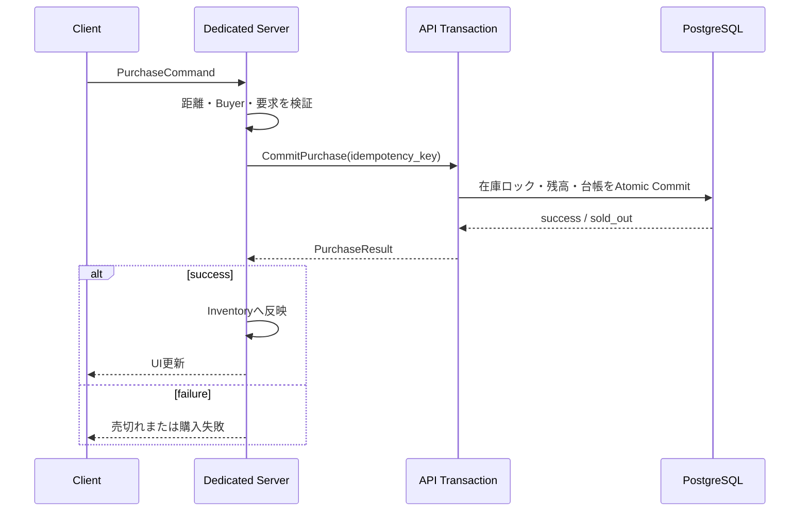
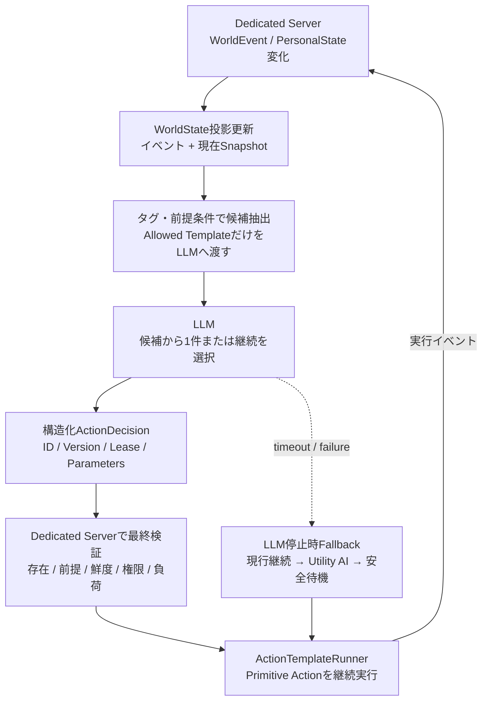

# Unityサバイバルゲーム（仮称） 基本設計書 v0.2.1

**全体アーキテクチャ・責任境界・ドメイン設計**

本書は、会話で確定した要件を実装可能な設計へ整理した基準文書です。未確定値は「暫定」または「TBD」と明示します。

## 文書管理（変更履歴）

| 版 | 日付 | 変更内容 |
|---|---|---|
| 0.1 | 2026-07-11 | 初版。全体アーキテクチャ、AIアクター、経済、狩猟/採掘/武器開発、WorldState主導イベント、注意事項（3D TPS/共有インベントリ/非干渉/永続化）を定義。 |
| 0.2 | 2026-07-11 | 別案（ChatGPT版 v0.1）と全面マージ。**NATS JetStream + gRPC + Outbox/Inbox**、**PostgreSQL基準**、**採掘・狩猟・武器開発を縦切りMVPに包含**、Join Ticket、Damage Matrix、セキュリティ/運用/アセットパイプライン、参考文献を統合。v0.1の具体データ構造（C#クラス、urgencyフォールバック）を保持。 |
| 0.2.1 | 2026-07-11 | レビュー指摘の整合性4点を明文化。**Inventoryの単一Writer原則**（セッション=DS／永続=API）、**PersonalStateの正本分離**（runtime/projection）、**Domain Eventの単一Writer**（永続はAPIのみ、WorldStateはConsumer）、**製作・狩猟の循環依存解消**（Stone Spear段階化）。加えて**データ所有権マトリクス**（第9.4章）を新設。 |

## 設計決定ログ（v0.2 で確定）

| ID | 決定 | 内容 | 根拠 |
|---|---|---|---|
| DEC-01 | 統合方針 | 2案を全面マージしv0.2として再構成 | 双方の網羅性を最大化 |
| DEC-02 | 非同期基盤 | **NATS JetStream + gRPC(Protobuf) + Outbox/Inbox** を採用 | LLM/イベントの疎結合・再配信・冪等性。重要データの信頼性を担保 |
| DEC-03 | MVPスコープ | 採掘→製作→狩猟→料理→食事→ゴミ→清掃 を**縦切りMVP**に含める | ゲームの核ループを早期検証 |
| DEC-04 | DB | **PostgreSQL を基準**。ただしアクセスはリポジトリ層で抽象化 | 同時購入・有限在庫・台帳・投影の整合性をRDBに集約 |

> 最上位の設計原則
>
> - Unity Dedicated Server がリアルタイムなワールドシミュレーションの権威を持つ。
> - クライアントは Auth/Matchmaking と Dedicated Server だけに接続し、API・WorldState へ直接接続しない。
> - 重要データはすべてサーバーに永続化し、クライアント保存は削除可能なキャッシュに限定する。
> - LLM は登録済みテンプレートの選択・パラメータ提案のみを行い、座標・通貨・アイテム生成を直接確定しない。
> - AI とプレイヤーは同じワールド資源を利用できるが、MVPでは相互攻撃・直接取引・会話などの直接インタラクションを禁止する。

---

## 1. 文書目的と設計方針

本書は、3D三人称視点の永続型サバイバルゲームと、自律AI社会シミュレーションを実装するための全体基本設計を定義する。個別のクラス、テーブル、API、受入試験は「MVP要件・詳細設計書 v0.2」で具体化する。

### 1.1 対象範囲

- Unity Client、Unity Dedicated Server、Auth/Matchmaking、API/Batch、WorldState/LLM Worker、PostgreSQL、NATS JetStream。
- キャラクター操作、共通インベントリ、空腹、農園、料理、ゴミ、物販、狩猟、採掘、ブラックスミス・デベロップメント。
- AIアクターの PersonalState、欲しいリスト、資産増加行動、行動テンプレート、WorldState連携。
- 大規模狩猟、レア素材放出、レアバイヤー出現のワールドイベント。
- Blender Python によるモジュラーアセット生成パイプライン。

### 1.2 対象外・後続設計

- 課金、外部プラットフォームアカウント連携、チート対策製品の選定。
- 本番クラウド事業者、Kubernetes、リージョン構成、災害対策の最終決定。
- プレイヤーとAIの会話・直接売買・攻撃・評判・人間関係。
- 大規模兵器の詳細な物理・弾道・車両システム。

---

## 2. 要件サマリー

| ID | 領域 | 基本要件 |
|---|---|---|
| BR-001 | 表示・操作 | 3D三人称視点。WASD移動、マウス視点、キーボード/マウス操作を Unity Input System で抽象化する。[R3] |
| BR-002 | ネットワーク | FishNet を用いた Dedicated Server 方式。クライアント入力をサーバーで検証し状態を複製する。[R4][R5] |
| BR-003 | サーバー境界 | Client→Auth/Matchmaking、Client→Dedicated Server のみ。API/WorldState は内部ネットワーク限定。 |
| BR-004 | 永続化 | アカウント、キャラクター、インベントリ、資産、World Save、AI PersonalState、イベント履歴をサーバー保存する。 |
| BR-005 | インベントリ | プレイヤーとAIが同じドメインモデルの専用インベントリを保持する。AIは PersonalState と欲求に基づいて整理・売却・廃棄する。 |
| BR-006 | 直接干渉制限 | プレイヤーとAIは相互に攻撃・直接取引・直接インタラクトできない。共有資源・共有バイヤーによる間接競争は許可する。 |
| BR-007 | AI | AIは Dedicated Server で実行し、WorldState 上の LLM がタグ付き行動テンプレートの切替を非同期判断する。 |
| BR-008 | イベント | WorldState がワールド状況を評価して登録済みイベントを提案し、Dedicated Server が検証・実行する。 |
| BR-009 | 経済 | 有限在庫・ランダム商品を持つバイヤー、購入トランザクション、所有財産ランキングを実装する。 |
| BR-010 | アセット | Blender Python でモジュラー形状、Socket、Collider、LOD、Manifest を生成する。 |

---

## 3. システム全体構成

**図3-1 システム全体構成**



Unity Client はログインとマッチングのみ Auth/Matchmaking へ HTTPS 接続し、発行された短寿命の Join Ticket を FishNet 接続時に Dedicated Server へ提示する。Dedicated Server はゲーム内状態とAIを実行し、重要な永続処理を API へ、イベント投影と LLM 判断を WorldState へ連携する。

### 3.1 技術スタック

| 領域 | 採用技術 | 基本方針 |
|---|---|---|
| Unity Client / Dedicated Server | C# / Unity 6000.5.x | 3D、入力、物理、NavMesh、FishNet。Dedicated Server モジュールを CI に導入。[R2] |
| Network Library | FishNet | サーバー権威、Dedicated Server、Authenticator 拡張を利用。[R4][R5][R6] |
| Auth / Matchmaking | Go | 高並行I/O、単一バイナリ、静的型、運用容易性。 |
| API / Batch | Go | 重要取引とバッチを同一ドメイン型で共有し、プロセスは分離。 |
| WorldState API | Python / FastAPI | LLM・データ処理ライブラリとの親和性。 |
| LLM Worker | Python Worker | 重い処理を API/FastAPI プロセスから分離。BackgroundTasks に重要ジョブを依存させない。[R7] |
| 同期内部通信 | gRPC + Protobuf | C#/Go/Python 間で型定義を共有。 |
| 非同期通信 | NATS JetStream | イベント永続化、再配信、at-least-once 前提の冪等 Consumer。[R8][R9] |
| DB | PostgreSQL | RDBトランザクション、JSONB投影、イベント量増加時のパーティション拡張。[R10][R11] |
| アセット生成 | Blender Python | bpy でモジュラー生成と glTF/FBX 出力を自動化。[R14] |

### 3.2 データ権威モデル

**図3-2 データの正本と投影の境界**



| データ | 正本 | 更新権限 | 備考 |
|---|---|---|---|
| アカウント・認証情報 | Auth DB | Auth/Matchmaking | 他サービスは account_id と検証済み Claims のみ使用。 |
| 座標・体力・空腹・採取状態 | メモリ上の Dedicated Server | Dedicated Server | クライアント入力は命令であり状態値ではない。 |
| セッション中インベントリ | Dedicated Server（メモリ） | **Dedicated Server（唯一のセッションWriter）** | 変更イベントを API へ永続化。購入は API 確定後に DS が反映（第6.1、MVP第12.2）。 |
| 永続インベントリ | API DB | **API Server（唯一の永続Writer）** | inventory_entries の確定はAPIのみ。DSはVersion整合の上で反映。 |
| 通貨・所有権・Buyer在庫 | API DB | API Server | 必ずトランザクションと冪等キーを使用。 |
| World Save | API DB | API Server | Dedicated Server の Snapshot/Event から復元。 |
| AI PersonalState（runtime 正本） | Dedicated Server（メモリ） | **Dedicated Server** | actor_runtime_states として API DB へ永続化。再起動復元に使用。 |
| AI PersonalState（投影） | WorldState DB | **WorldState Consumer** | actor_state_projections。LLM判断/検索/統計用。再構築可能。 |
| 永続 Domain Event | API DB（domain_events） | **API Server（唯一のWriter）** | DSがevent_id+local_sequence生成→Outbox→APIが重複排除して確定。WorldStateは読むだけ。 |
| WorldState・LLM履歴 | WorldState DB | WorldState | 投影/履歴。ゲーム資産の正本にはしない。 |
| クライアント保存 | Client Cache | Client | 表示設定、Addressables、直近受信状態のみ。 |

---

## 4. サービス別基本設計

### 4.1 Auth / Matchmaking Server（Go）

- ユーザーアカウント作成、ログイン、ログアウト、パスワード変更、トークン更新・失効を提供する。
- Dedicated Server の登録、Heartbeat、収容人数、ワールドID、ビルド互換性を管理する。
- マッチング結果として server endpoint と 60秒程度の使い捨て Join Ticket を返す（期限は設定化）。
- Join Ticket は account_id, character_id, world_id, server_id, build_id, issued_at, expires_at, nonce を含み署名する。
- Dedicated Server は FishNet Authenticator で Ticket を検証し、内部APIで一度だけ消費する。[R6]

### 4.2 API / Batch Server（Go）

- World Save、キャラクター、インベントリ、アイテム個体、通貨台帳、所有権、Buyer在庫、購入を管理する。
- ゲームプレイ由来の変更を Dedicated Server から受け取り、event_id/idempotency_key で重複適用を防止する。
- Buyer購入は在庫減算・残高減算・所有権付与・台帳記録を単一DBトランザクションで確定する。
- ランキング、イベント集計、古いイベントのアーカイブ、Snapshot圧縮を Batch Worker で行う。
- API と Batch はコードベースを共有しても、別プロセス・別スケール単位とする。

### 4.3 WorldState Server / LLM Worker（Python/FastAPI）

- Dedicated Server が発行したイベントを購読し、ワールドスナップショットと AI別 PersonalState 投影（actor_state_projections）を更新する。**domain_events へは書き込まず、Projection専用テーブルのみを更新する**（永続イベントのWriterはAPIのみ）。
- タグと前提条件で候補テンプレートを決定してから LLM へ渡し、自由形式のゲーム命令を生成させない。
- AI行動判断と World Event 判断を Job として永続化し、Worker が非同期処理する。
- LLM出力は JSON Schema/Protobuf で検証し、Dedicated Server による再検証を必須とする。
- LLM停止中も Dedicated Server の現在行動・Utility AI・安全待機でゲームを継続する。

### 4.4 NATS JetStream

JetStream は WorldEvent、AI Decision Request/Result、World Event Proposal/Result、永続化通知の疎結合化に用いる。Consumer は再配信前提で、event_id / decision_id による冪等処理を実装する。[R8][R9]

主要 Subject: `world.{world_id}.event.*` / `ai.decision.request` / `ai.decision.result.{server_id}` / `worldevent.proposal.{server_id}` / `worldevent.result` / `persistence.snapshot.completed` / `batch.ranking.request`

---

## 5. クライアント・Dedicated Server設計

### 5.1 3D三人称クライアント

- 移動は W/A/S/D、視点はマウス、ジャンプ・ダッシュ・インタラクト・攻撃・インベントリを Action Map として定義する。
- 入力を Unity Input System へ統一し、キー割当をデータ化する。Legacy Input Manager は新規実装に使用しない。[R3]
- カメラはクライアント専用。キャラクターの最終Transform・行動成立・ダメージ・採取結果は Dedicated Server が確定する。
- 所有キャラクターはクライアント予測とサーバー Reconciliation、他キャラクターは Interpolation を基本とする。
- 重要状態はローカルへ正本保存しない。キャッシュ削除後もログインして復旧できることを要件とする。

### 5.2 Dedicated Server実行モデル

- 固定Tick（暫定20Hz）でプレイヤー入力、AI、動物、資源、行動テンプレートを更新する。
- ゲームプレイコマンドは認証済みConnection、所有権、距離、Cooldown、必要アイテム、状態Versionを検証する。
- レンダリング・音声・UI・カメラ処理を Dedicated Server ビルドから除外/無効化する。[R2]
- NetworkObject はカテゴリ別に Interest Management を適用し、遠距離の不要な複製を減らす。
- 停止時は新規接続を止め、重要取引完了→最終Snapshot→イベントFlush の順で Graceful Shutdown を行う。

### 5.3 プレイヤーとAIの非干渉ポリシー

| 項目 | 方針 |
|---|---|
| 攻撃 | Player→AI、AI→Player の Damage を常に拒否。照準対象にも含めない。 |
| 直接取引 | 相手インベントリを対象にする TransferCommand を提供しない。 |
| 会話・命令 | MVPでは Dialogue/Command UI・AIへの依頼を実装しない。 |
| 衝突 | 押し出し・進路妨害を避けるため、Character同士は非ブロッキング推奨。 |
| 共有世界 | 鉱脈・動物・Buyer在庫・イベントへの参加は共有可能。結果として間接競争が発生する。 |

（詳細な Damage Matrix は MVP詳細設計書 第6.4章）

---

## 6. ゲームドメイン基本設計

### 6.1 キャラクターと共通インベントリ

プレイヤーとAIは同一の Inventory ドメインを使用する。プレイヤー向けUI/Network Replication と AI向け評価ロジックは Adapter で分離し、アイテム移動規則・Stack・重量・予約・所有権は共通化する。

| 概念 | 主要属性 |
|---|---|
| InventoryOwner | owner_type, owner_id, capacity_slots, capacity_weight, version |
| InventoryEntry | slot_index, item_definition_id, item_instance_id, quantity, reserved_quantity |
| ItemDefinition | tags, stack_limit, weight, base_value, use_action, discard_policy |
| ItemInstance | quality, durability, created_by, acquired_at, last_used_at, custom_attributes |
| InventoryCommand | command_id, expected_version, operation, source, destination, quantity |

参考実装（C#・v0.1由来。上表の具体化）:

```csharp
public enum ItemCategory { Crop, Food, Garbage, Material, House, LuxuryDecor,
                           Meat, Ore, Metal, Weapon }

[Serializable]
public class ItemDefinition {
    public string itemDefinitionId;
    public string displayName;
    public ItemCategory category;
    public long baseValue;
    public int satietyValue;      // 食料以外は0
    public int garbageOnUse;      // 消費後に出るゴミ数
    public int rarity;            // 0=common..3=epic（レア肉/レア素材/レア武器）
    public int stackLimit;
    public float weight;
    public string[] tags;         // ["food","luxury","rare"] 等
}

[Serializable]
public class InventoryOwner {
    public string ownerType;      // "player" | "ai"
    public string ownerId;
    public int capacitySlots;
    public float capacityWeight;
    public long version;          // Mutation成功ごとに+1
    public List<InventoryEntry> entries = new();
    public bool IsOverflow => entries.Count > capacitySlots;
}
```

> 同時更新対策: Inventory は version を持ち、購入・製作・採取・廃棄などの操作を Dedicated Server 上で直列化する。API永続化では event_id と expected_version を用い、再送による二重付与を防ぐ。

**Inventory の単一Writer原則（v0.2.1 で明文化）**

APIとDSがInventoryを二重Writeしないよう、書き込み責任を層で分ける。

```text
セッション中Inventory Writer : Unity Dedicated Server（メモリ上の正本）
永続Inventory Writer         : API Server（inventory_entries）

購入フロー（唯一の例外的経路も同一原則で扱う）:
  1. DS → API: CommitPurchase(idempotency_key)
  2. API: 通貨・在庫・所有権・inventory_entries を単一Txで確定
  3. API → DS: PurchaseCommitted(付与item, new_persisted_version)
  4. DS: Runtime Inventory へ反映し version をインクリメント
  5. DS → API: 以降の通常InventoryイベントはOutbox経由で送信
```

購入時にAPIが `inventory_entries` を直接確定するのは「永続Writer=API」の原則どおりであり矛盾しない。DSは購入結果を受けてRuntimeへ反映するのみで、同じ付与を二重に永続化しない（付与の永続はAPIのCommitで既に完了）。DSのRuntime version と API の永続 version は、購入応答に含まれる `new_persisted_version` で突き合わせ、ズレ検知時は Inventory Snapshot 再同期を行う。

### 6.2 サバイバル状態

- Health、Hunger、Stamina を基本状態とし、将来の Thirst/Temperature/Disease を追加可能な Stat Definition 方式とする。
- AIも同じ Hunger 等を持つが、UI表示は不要。PersonalState の欲求スコアへ変換する。
- 食事は食料を消費して Hunger を回復し、レシピに応じて容器・残飯などの Waste Item を生成する。
- インベントリが満杯の場合、AIは価値・必要性・最終利用時刻・性格から売却/廃棄候補を選ぶ。

### 6.3 生産・消費システム

| システム | 基本モデル |
|---|---|
| 農園 | 畑区画、作付け、成長、収穫。MVPは単一作物、後続で土壌・季節・病害。 |
| 動物飼育 | 給餌、成長、繁殖、産物。MVP対象外だが同じ Resource/Production Job モデルへ追加。 |
| 料理 | Station、Recipe、材料予約、所要時間、出力、Waste出力。 |
| 狩猟 | 追跡、攻撃、討伐、解体、Drop Table。通常肉・レア肉・皮・骨・特殊素材。 |
| 採掘 | Resource Node、残量、硬度、Tool Tag、品質、再生成・イベント紐付け。 |
| ブラックスミス | 既知 Blueprint からの製造、修理、品質計算。 |
| デベロップメント | 研究プロジェクト、素材投入、試作、設計図解放。 |
| ハウジング | 土地・建物・家具・所有権。基本設計に含むがMVPでは固定拠点/購入ハウスのみ。 |
| 物販 | 有限在庫Buyer、ランダム商品、購入Transaction、売却・ランキング。 |

**生産チェーン（素材フロー・v0.1由来）**:

```
  採掘 ─→ 石 / 金属 / レア金属 ─┐
                              ├─→ [ブラックスミス/開発] ─→ 武器/兵器（売買・財産・狩猟効率）
  （バイヤー購入）───────────────┘
  狩猟 ─→ 肉 / レア肉 / 皮・骨・素材 ─→ 料理（食料+ゴミ） / 売却
```

### 6.4 Buyerと経済

- Buyer は定期出現し、buyer_instance_id、出現時間、消滅時間、inventory_seed、price_modifier を持つ。
- 在庫は重み付き抽選かつ有限であり、レアBuyerでもレア商品が一つも生成されない場合を許容する。
- 高額だが生活効率の低い高級品、高額フード、高級住宅、装飾武器を通貨回収・所有欲の対象とする。
- 高額フードは通常品より多くのゴミを生成しても、満腹度などの生存効果は優遇しない。
- 資産ランキングは現金・売却可能品・住宅/設備等の評価額から計算し、評価価格Versionを記録する。

**図6-1 Buyer購入の権威フロー**



---

## 7. AIアクター基本設計

**図7-1 AI行動判断と実行の分離**



### 7.1 二層ループの原則（v0.1由来）

AI行動は「テンプレを実行し続ける高速ローカル層」と「テンプレを切り替える低速LLM層」に分離する。**LLMから新しい承認済み Decision が届くまで、同じテンプレートを継続する**（LLM待ちの間もAIは止まらない）。

### 7.2 PersonalState

| 区分 | 主な要素 |
|---|---|
| 生存欲求 | hunger, health_risk, fatigue, safety |
| 生活欲求 | comfort, cleanliness, inventory_pressure, home_quality |
| 経済欲求 | cash, net_worth, wealth_goal, status_desire, risk_tolerance |
| 所有・記憶 | wanted_items, owned_assets, recent_purchases, last_used_at, retention_score |
| 行動状態 | active_template, template_version, started_at, lease_until, target_refs, failure_count |
| 性格 | greed, tidiness, patience, curiosity, event_preference, sociality（将来用） |

### 7.3 行動テンプレート

Action Template はデータとして登録し、Primitive Action のみ C# 実装とする。既存 Primitive だけで構成できるテンプレートはサーバー再ビルドなしで追加可能にし、未知の Primitive を追加する場合のみコード更新を要する。**タグ付き**により WorldState/LLM が候補から選択する。

```json
{
  "template_id": "economy.sell_surplus",
  "version": 3,
  "tags": ["wealth", "inventory_overflow", "market_available"],
  "preconditions": ["inventory.free_slots < 3", "inventory.sellable_count > 0"],
  "interrupts": ["health_critical", "target_missing", "path_failed"],
  "steps": ["SelectSellableItem", "FindBuyer", "MoveTo", "RequestSale"],
  "min_duration_sec": 20,
  "max_duration_sec": 600
}
```

### 7.4 判断頻度・継続条件・フォールバック（v0.1のurgency式を統合）

- 状態変化イベント、テンプレート完了、Lease期限、失敗回数、重大欲求の発生時に再判断を要求する。
- LLMは候補外 template_id を返せず、自由な C# メソッド名・座標・アイテムID生成を行えない。
- **LLM不在/失敗時の数値フォールバック**（Dedicated Serverが安価に評価）:

```
urgency(food)     = clamp01((60 - hunger) / 60)
urgency(cleanup)  = clamp01((used_slots - capacity) / capacity)
urgency(earn)     = clamp01((wealth_goal - net_worth) / max(wealth_goal,1))
```

最大 urgency のタグに対応するテンプレへ切替。同点は `food > cleanup > earn > sell` の順。これにより LLM の遅延・コスト・障害がゲーム進行のブロッカーにならない。

---

## 8. WorldState・ワールドイベント設計

### 8.1 イベント＋現在スナップショット

WorldState は append-only のイベントと、検索・LLM入力に適した現在スナップショットを併用する。event_id, world_id, aggregate_id, sequence, occurred_at, schema_version を必須とし、イベントを正として投影を再構築できる。

```json
{
  "event_id": "01J...",
  "world_id": "world-001",
  "aggregate_type": "actor",
  "aggregate_id": "ai-0042",
  "event_type": "ItemDiscarded",
  "sequence": 1842,
  "occurred_at": "2026-07-11T10:20:30Z",
  "schema_version": 1,
  "payload": { "item_id": "food-container-991", "reason": "inventory_overflow" }
}
```

### 8.2 World Event Director（WorldState主導）

| イベント | 基本動作 |
|---|---|
| 大規模狩猟 | 特定地域へレア獣を段階的に追加。rare meat rate、aggression 等の Modifier を付与。 |
| レア素材放出 | 希少鉱脈の生成、既存鉱脈の品質上昇、枯渇鉱脈の一時復活。 |
| レアBuyer大量発生 | 複数の特殊Buyerを期間限定出現。在庫は各個体で有限・ランダム。 |

- LLMはイベントテンプレート、地域タグ、理由タグ、強度の希望値、開始希望Windowを提案する。
- 具体的なスポーン数・供給予算・報酬・座標・同時生存数はルールエンジンと Dedicated Server が決定する。
- Dedicated Server は負荷・競合イベント・地域利用可否・Version を検証し、拒否できる。
- イベント状態は Proposed→Approved→Scheduled→Preparing→Active→Completing→Completed とする。

---

## 9. データ・永続化設計

### 9.1 DB選定（DEC-04: PostgreSQL基準）

本設計では PostgreSQL を MVP から採用する。ファイルDBでも永続化自体は可能だが、複数サービス・同時購入・有限在庫・通貨台帳・ランキング・イベント投影の整合性を一つのRDBで扱う方が設計を単純化できる。WorldState の可変Payloadは JSONB を利用し、イベント量増加後に world_id・occurred_at によるパーティションを適用する。[R10][R11]

> 移植性の担保: DBアクセスはリポジトリ層で抽象化し、将来の分割・別DB採用に備える。

### 9.2 保存単位と復旧

| 保存種別 | 対象 | 保証 |
|---|---|---|
| 重要Transaction | 購入、通貨、所有権 | DB Commit完了後に成功応答。認識済み成功の損失を許容しない。 |
| Gameplay Event | 採取、製作、消費、廃棄 | Dedicated Server Outbox から非同期送信。event_id で重複排除。 |
| World Snapshot | World Entity、Node残量、AI状態 | 定期および Graceful Shutdown 時。Replay量を制限。 |
| Client Cache | 表示設定、Addressables、画面状態 | 削除可能。サーバー正本の復旧に影響しない。 |

### 9.3 主要データ領域

- Identity: accounts, password_credentials, refresh_tokens, characters。
- World: worlds, game_servers, world_snapshots, world_entities, resource_nodes。
- Inventory/Economy: inventories, inventory_entries, item_instances, currency_ledger, ownerships。
- Buyer: buyer_instances, buyer_stock, purchase_transactions。
- AI/WorldState: actor_personal_states, world_events, world_projections, ai_decisions, action_templates。
- Operations: outbox_messages, inbox_dedup, batch_jobs, asset_rankings。

### 9.4 データ所有権マトリクス（唯一のWriter）

各データの「唯一の書き込み者（Writer）」を固定し、二重Writeを構造的に排除する。Reader（参照のみ）は複数可。

| データ / テーブル | 唯一のWriter | 主なReader | 備考 |
|---|---|---|---|
| accounts / password_credentials / refresh_tokens | Auth | Auth | 他は account_id と検証済みClaimsのみ利用 |
| game_servers / join_tickets | Auth | Auth, DS(検証) | Ticketの used_at 更新もAuthが原子的に実施 |
| characters / worlds | API | DS(読) | キャラ・ワールドメタ |
| 座標・体力・空腹（ライブ） | Dedicated Server | Client(複製) | メモリ正本。永続はSnapshot/Event経由 |
| セッション中Inventory | Dedicated Server | Client(複製) | メモリ正本 |
| inventory_entries / item_instances（永続） | **API** | DS(起動復元) | 購入・確定はAPIのみ |
| currency_ledger / ownerships | **API** | DS(読) | Txと冪等キー必須 |
| buyer_instances / buyer_stock / purchase_transactions | **API** | DS(表示) | 在庫はrow lock/version更新 |
| world_snapshots | **API** | DS(復元) | staging→checksum→active切替 |
| domain_events（永続） | **API** | WorldState(Consumer), Batch | DSがevent_id+local_sequence生成しOutboxへ。APIが重複排除して確定 |
| actor_runtime_states | **Dedicated Server**（生成）→ API(永続化) | DS(復元) | 再起動復元用。永続書き込みはAPI経由だがフィールドの権威はDS |
| actor_state_projections | **WorldState Consumer** | LLM Worker | 再構築可能な投影 |
| action_templates | WorldState（登録） | DS, LLM | Definition Data。Version管理 |
| ai_decisions | WorldState / LLM Worker | DS(検証) | 判断履歴 |
| world_event_instances | **API**（登録） / DS(状態遷移をEvent化) | WorldState | 状態はProposed→…→Completed |
| asset_rankings | **Batch** | API(参照) | 定期計算 |
| outbox_messages | 各Service（自分のOutbox） | 自分のRelay | サービスごとに独立 |
| inbox_dedup | 各Consumer | 自分 | 冪等処理用 |
| Client Cache | Client | Client | 表示・設定のみ。重要データ禁止 |

> 原則: 「runtime（メモリ）の正本」と「永続の正本」を分け、永続の確定は必ずAPI（または各サービスの自ドメイン）に集約する。WorldStateは**投影専用**で、正本テーブルへは書かない。

---

## 10. 通信・API・イベント設計

| 経路 | 方式 | 用途 |
|---|---|---|
| Client→Auth | HTTPS/JSON | Account、Session、Refresh、Matchmaking。 |
| Client→Dedicated Server | FishNet | Input、Gameplay Command、State Replication。 |
| Dedicated Server→Auth | 内部gRPC | Join Ticket消費、Server Heartbeat。 |
| Dedicated Server→API | 内部gRPC | World Bootstrap、Snapshot、Event Append、Purchase。 |
| Dedicated Server↔WorldState | NATS + 必要時内部gRPC | WorldEvent、Decision、World Event Proposal。 |
| Batch→DB/NATS | SQL/NATS | ランキング、アーカイブ、集計完了通知。 |

### 10.1 共通メッセージ規約

- すべての Command/Event に message_id, correlation_id, causation_id, schema_version, occurred_at を持たせる。
- 更新Commandは idempotency_key または expected_version を必須とする。
- 時刻はUTC、IDは UUIDv7 または ULID 相当の時系列ソート可能IDを推奨する。
- 互換性は後方互換フィールド追加を基本とし、破壊的変更は新しい schema_version/subject を使用する。

---

## 11. セキュリティ設計

| 領域 | 基本対策 |
|---|---|
| パスワード | Argon2id でハッシュ化し、平文・可逆暗号化を禁止。設定値は OWASP 推奨を下限に負荷試験で調整。[R12] |
| Access Token | 短寿命、audience/scope/server用途を限定。 |
| Refresh Token | ローテーション、再利用検知、DBではハッシュ保存。RFC 9700 に準拠。[R13] |
| Join Ticket | 短寿命、単回使用、server_id/build_id を固定、署名検証。 |
| 内部通信 | TLS、サービス資格情報、ネットワークACL。API/WorldState を Public 公開しない。 |
| ゲーム権威 | クライアントは入力だけ送信。座標・ドロップ・購入・通貨・Damage を直接指定できない。 |
| LLM | 候補限定、構造化Schema、Prompt/Output記録、Dedicated Server 検証、予算・Rate Limit。 |
| 監査 | 購入・所有権・管理操作・Ticket消費・LLM決定を相関ID付きで記録。 |

---

## 12. アセットパイプライン設計（Blender Python）

- Blender Python スクリプトを CLI/バッチ実行し、モジュール形状・原点・Socket・UV・Material Slot・LOD・Collider を生成する。
- 各アセットに asset_id, asset_version, dimensions, pivot_type, socket_definitions, collision_type, navigation_flags を付与する。
- 出力は glTF/GLB または FBX と Manifest JSON。Unity Importer が Prefab・Collider・NavMesh Modifier・Interaction Point を自動設定する。[R14]
- Client用は描画・LOD・Material を含み、Dedicated Server 用は Collider・NavMesh・Interaction metadata 中心の軽量データを生成する。
- 同一 asset_id/version の出力を決定的にし、CI で Manifest・三角形数・Socket・Collider を検査する。

---

## 13. 運用・監視・障害設計

| 領域 | 設計 |
|---|---|
| Logging | JSON構造化。world_id, server_id, account_id, actor_id, correlation_id を付与。 |
| Metrics | 接続数、Tick時間、AI数、NavMesh失敗、イベントLag、DB latency、Buyer sold-out、LLM latency/cost。 |
| Tracing | Auth→Matchmaking→Join、DS→Purchase、WorldEvent→LLM→Decision を分散Trace。 |
| Health | liveness/readiness/dependency health。Dedicated Server は Ready 後のみマッチ対象。 |
| Backup | PostgreSQL 定期Backup、Restore Drill。MVPは単一リージョン、後続で PITR/Replica。 |
| 障害時 | LLM停止はフォールバック、NATS停止は Outbox 蓄積、API停止は重要取引を失敗として返し再試行。 |

---

## 14. 非機能要件と拡張方針

- サーバー権威・冪等性・再起動復元・クライアントキャッシュ削除耐性を機能要件と同じ優先度で検証する。
- MVPは単一World・単一Dedicated Serverから開始し、world_id を境界に水平分割可能なID/Subject/Table設計とする。
- AI・動物・遠距離エンティティは更新頻度を階層化し、全Actorを毎Frame高精度計算しない。
- 行動テンプレート・Recipe・Item・Buyer・World Event は Definition Data として Version 管理する。
- 本番化時は負荷試験結果から Tick・Interest範囲・AI上限・Snapshot周期・LLM Rate を決定する。

---

## 15. リスク・未決事項

| ID | 項目 | 対応・決定方針 |
|---|---|---|
| RISK-01 | LLMコスト・遅延 | 高頻度個別呼出しは高コスト。候補絞込、イベント駆動、Batch、Lease、Rate Limit で抑制。 |
| RISK-02 | Unityメインスレッド負荷 | AI/NavMesh/動物増でTick超過。LOD AI、時間分割、Profiler基準の上限を設定。 |
| RISK-03 | 経済インフレ | イベント大量放出とBuyer購入で資産価値が崩れる。供給予算・価格Version・統計監視。 |
| RISK-04 | 二重付与 | 再送・切断でアイテム/通貨重複。Outbox/Inbox、冪等キー、DB Transaction を徹底。 |
| RISK-05 | FishNet更新 | Package API変更の影響。package lock と Network smoke test を Upgrade Gate に。 |
| TBD-01 | 最終同時接続数 | MVP暫定16人。製品要件は負荷試験とゲームデザイン後に確定。 |
| TBD-02 | LLM Provider | Provider抽象化を前提とし、モデル・オンプレ/外部・データ保持条件を別途決定。 |
| TBD-03 | 対象OS | MVP Client は Windows、Dedicated Server は Linux を暫定。 |

---

## 参考資料

[R1] [Unity 6000.5.3f1 Release Notes](https://unity.com/releases/editor/whats-new/6000.5.3f1)
[R2] [Unity 6.5 Dedicated Server requirements](https://docs.unity3d.com/6000.5/Documentation/Manual/dedicated-server-requirements.html)
[R3] [Unity 6.5 Input manual](https://docs.unity3d.com/6000.5/Documentation/Manual/Input.html)
[R4] [FishNet overview](https://fish-networking.gitbook.io/docs)
[R5] [FishNet Dedicated Server tutorial](https://fish-networking.gitbook.io/docs/tutorials/simple/building-a-dedicated-server)
[R6] [FishNet Authenticator](https://fish-networking.gitbook.io/docs/fishnet-building-blocks/components/utilities/authenticator)
[R7] [FastAPI Background Tasks caveat](https://fastapi.tiangolo.com/tutorial/background-tasks/)
[R8] [NATS JetStream](https://docs.nats.io/nats-concepts/jetstream)
[R9] [NATS JetStream Consumers](https://docs.nats.io/nats-concepts/jetstream/consumers)
[R10] [PostgreSQL JSON types](https://www.postgresql.org/docs/current/datatype-json.html)
[R11] [PostgreSQL table partitioning](https://www.postgresql.org/docs/current/ddl-partitioning.html)
[R12] [OWASP Password Storage Cheat Sheet](https://cheatsheetseries.owasp.org/cheatsheets/Password_Storage_Cheat_Sheet.html)
[R13] [RFC 9700 OAuth 2.0 Security BCP](https://datatracker.ietf.org/doc/rfc9700/)
[R14] [Blender Python Export Scene API](https://docs.blender.org/api/current/bpy.ops.export_scene.html)
