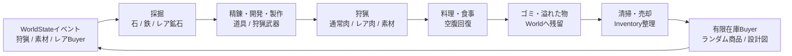
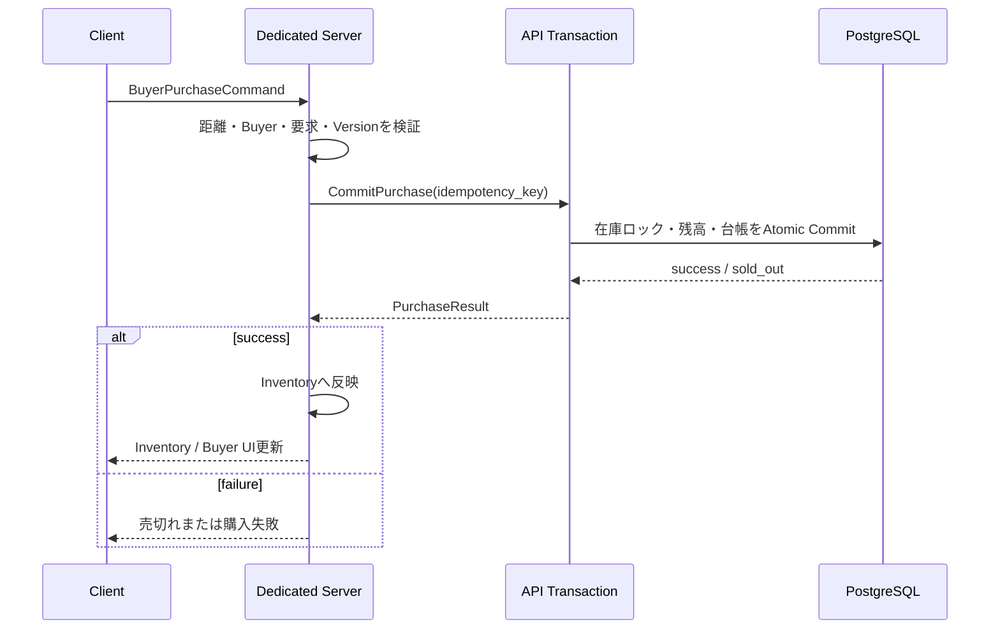

# Unityサバイバルゲーム（仮称） MVP要件・詳細設計書 v0.2.2

**縦切りスコープ・機能仕様・データ・API・受入条件**

本書は上位文書 BSD-001 v0.2 を前提とし、MVPを実装可能なレベルへ具体化する。未確定値は「暫定」または「TBD」と明示する。矛盾時はデータ権威・セキュリティ境界について基本設計書を優先する。

## 文書管理（変更履歴）

| 版 | 日付 | 変更内容 |
|---|---|---|
| 0.1 | 2026-07-11 | 初版。MVPスコープ/DoD、Item・Inventory・Wealth、PersonalState、タグ付きActionTemplate、urgencyフォールバック、WorldState(イベント+Snapshot)、LLM判断API、認証/API/セーブ、実装マイルストーン、追加機能(狩猟/採掘/武器/バイヤー在庫/イベント)のデータ構造を定義。 |
| 0.2 | 2026-07-11 | 別案(ChatGPT版)と全面マージ。**採掘・狩猟・武器開発を縦切りMVPに包含(DEC-03)**、**NATS+gRPC+Outbox(DEC-02)**、**PostgreSQL(DEC-04)**を反映。Join Ticket、Damage Matrix、性能目標、受入試験(AT-001..020)、DoD、DB論理設計、Requirement Traceability を統合。v0.1のC#データ構造とurgency式を保持。 |
| 0.2.1 | 2026-07-11 | レビュー指摘4点を反映。①購入時Inventory反映プロトコル(単一Writer)を第12.2に明記、②`actor_personal_states`を`actor_runtime_states`/`actor_state_projections`に分割(第13章)、③`domain_events`の永続WriterをAPIのみに限定・WorldStateはConsumer化、④製作/狩猟の循環依存解消(**Stone Spear段階レシピ**, 第8.4)。付録Cに**データ所有権マトリクス**を追加。AT-021/022を追加。 |
| 0.2.2 | 2026-07-12 | Unityクライアント採用ライブラリを確定・追記（第5.5章）。**R3**(Reactive)・**VContainer**(DI)・**UniTask**(async)。導入方法・アーキ指針・アセンブリ検証の注意を記載。前提としてMCP導入済みの空URPプロジェクトを明記。 |

> - MVPはアーキテクチャと主要ゲームループを検証する縦切りであり、全製品機能の縮小版ではない。
> - 容量値・時間・個数は初期テスト用の暫定値で、ScriptableObject または Server Config で変更可能にする。

---

## 1. MVPの目的・成功条件

MVPは、ネットワーク、サーバー権威、永続化、AI自律行動、WorldStateイベント、有限在庫経済が一つの小規模ワールドで連動することを証明する。プレイヤー体験としては「採掘して武器を作り、狩猟して食べ、発生したゴミを処理し、Buyerと経済活動を行う」までを遊べる状態とする。

**図1-1 MVP縦切りゲームループ**



| ID | 成功条件 |
|---|---|
| SC-01 | Windows Client からアカウント作成・ログインし、マッチング後に Linux Dedicated Server へ接続できる。 |
| SC-02 | WASDとマウスで三人称キャラクターを操作し、他Clientへ状態が同期される。 |
| SC-03 | 採掘→製作→狩猟→解体→料理→食事→ゴミ生成→清掃/廃棄のループがサーバー権威で成立する。 |
| SC-04 | AIが同一Inventoryモデルと PersonalState を持ち、プレイヤー操作なしで上記ループの一部を継続する。 |
| SC-05 | プレイヤーとAIは同一サーバーに存在するが、相互攻撃・直接取引・直接インタラクトが成立しない。 |
| SC-06 | 有限在庫Buyerが定期出現し、ランダム在庫・売切れ・同時購入の競合が正しく処理される。 |
| SC-07 | WorldStateが3種類のイベントから一つを提案し、Dedicated Server が検証して実行する。 |
| SC-08 | Dedicated Server/Backend 再起動後にキャラクター/Inventory/Buyer/World/AI状態が許容範囲で復元される。 |
| SC-09 | Clientキャッシュを削除しても重要データを失わず再ログインできる。 |

---

## 2. スコープ

### 2.1 MVP In Scope

- Unity 6000.5.x、URP、Input System、FishNet、Windows Client、Linux Dedicated Server。
- クライアント基盤ライブラリ: **R3**(Reactive)、**VContainer**(DI)、**UniTask**(async)。前提: MCP導入済みの空URPプロジェクト（第5.5章）。
- アカウント作成、ログイン、Refresh、サーバー登録、簡易マッチング、Join Ticket認証。
- 1ワールド、1テストマップ、最大16プレイヤー、20 AIアクターの暫定ターゲット。
- 三人称移動、カメラ、走行、ジャンプ、Interact、狩猟攻撃。
- 専用Inventory、Stack、重量、Drop、Pickup、予約、Version。プレイヤーとAIで共通。
- Hunger、Health、食事、単一作物の農園、採掘、狩猟、解体、料理、ゴミ、清掃。
- Stone Pickaxe、Iron Hunting Spear、簡易Forge、1件のDevelopment解放。
- 通常Buyer、Rare Buyer、有限ランダム在庫、API Transaction、簡易資産ランキング。
- AI PersonalState、Wanted List、タグ付きAction Template、LLM非同期判断、Utility Fallback。
- Great Hunt、Rare Resource、Rare Buyer Rush の3 World Event。
- PostgreSQL永続化、NATS JetStream、Docker Compose開発環境、構造化ログ。
- Blender Python で生成した最小モジュラーキットと Unity 自動Import。

### 2.2 MVP Out of Scope

- プレイヤーとAIの攻撃・直接取引・会話・依頼・仲間化・評判。
- PvP、プレイヤー間直接取引、ギルド、チャット、フレンド。
- 本格ハウジング建築・土地所有、動物飼育、繁殖、季節・天候。
- 銃器、弾道、車両、大型兵器、複雑な防具・Damage Type。
- マルチリージョン、複数World自動Shard、Dedicated Server自動スケール、HA DB。
- ゲームパッド、モバイル、コンソール、アクセシビリティ最終対応。入力Actionは拡張可能にする。
- 課金、外部ID Provider、メール送信、本番運用の CS/GM Tool。

---

## 3. 暫定容量・性能目標

| 指標 | 暫定値 | 備考 |
|---|---|---|
| プレイヤー | 16 concurrent / world | 負荷試験の基準。設定値で変更可能。 |
| AIアクター | 20 active | 遠距離AIは低頻度更新。 |
| 動物 | 80 active、イベント時120上限 | 同時生存上限と総Spawn予算を分離。 |
| World Item | 500 active | 遠距離は低頻度・Interest対象外。 |
| Server Tick | 20 Hz目標 | Tick P95 ≤ 40ms、P99 ≤ 50ms を暫定Gate。 |
| Client Frame | 1080p試験環境で60fps目標 | 最終PC仕様はTBD。 |
| 通常操作応答 | P95 200ms以内(Server処理) | 採取・使用・Pickup。 |
| 購入 | P95 500ms以内(DB commit含む) | 成功応答前にDB確定。 |
| Snapshot | 30秒間隔 | 重要Transactionは別途即時確定。 |
| LLM判断 | 通常30秒以内、Hard timeout 60秒 | ゲーム進行をBlockingしない。 |
| 復旧損失 | 購入0件、非経済状態5秒以内を目標 | Outbox flush と Snapshot で達成。 |

---

## 4. MVPユーザーフロー

| ID | フロー | 概要 |
|---|---|---|
| UF-01 | 起動・ログイン | Client起動→キャッシュ読込→Authログイン→Token受領。 |
| UF-02 | マッチング | ClientがJoin要求→AuthがReadyなServerを選択→Join Ticket返却。 |
| UF-03 | 接続 | FishNet接続→AuthenticatorへTicket送信→Dedicated Serverが消費→Character Spawn。 |
| UF-04 | 収集 | 鉱脈へ移動→Pickaxeで採掘→Serverが鉄鉱石をInventoryへ付与。 |
| UF-05 | 開発・製作 | Forgeで材料投入→研究/製作→Iron Hunting Spear取得。 |
| UF-06 | 狩猟 | 動物へ攻撃→Server判定→討伐→解体→肉・素材取得。 |
| UF-07 | 料理・食事 | Cooking Stationで肉を調理→Cooked MeatとWaste生成→食べてHunger回復。 |
| UF-08 | 整理・経済 | 不要品をDrop/Dispose/Sell。Buyerから有限在庫商品を購入。 |
| UF-09 | World Event | WorldStateがイベント提案→Server承認→通知→対象Regionに反映。 |
| UF-10 | 終了・再開 | 切断/停止→保存→再ログイン→Server Snapshotから復元。 |

---

## 5. Unity Client詳細設計

### 5.1 シーン構成

| Scene | 責務 |
|---|---|
| Bootstrap | NetworkManager、Service Locator、Config、Logging、Auth UI。 |
| MainMenu | Account/Login、Character選択（MVPは1アカウント1キャラでも可）、Matchmaking。 |
| World_MVP | Forest、Mine、Camp、FarmPlot、Forge、Cooking Station、Buyer Spawn、Event Regions。 |

### 5.2 Input Action Map

| Action | Default Binding | 処理 |
|---|---|---|
| Move | WASD | Vector2。カメラYaw基準で移動。 |
| Look | Mouse Delta | Yaw/Pitch。Cursor Lock時のみ。 |
| Jump | Space | 接地中かつServer許可。 |
| Sprint | Left Shift | Stamina消費はMVPで省略可、速度のみ設定。 |
| Interact | E | 採掘、Pickup、Station、Buyer、清掃。 |
| PrimaryAction | Left Mouse | 装備に応じた狩猟攻撃。AI/Playerは Target Filter で除外。 |
| Inventory | Tab / I | Inventory UI開閉。 |
| Cancel | Esc | UI閉じる、Cursor解除。 |

### 5.3 Clientクラス構成

| クラス/サービス | 責務 |
|---|---|
| Bootstrapper | 依存サービス初期化、環境Config、ログ、Scene遷移。 |
| AuthClient | Auth/Matchmaking HTTPS。TokenはOS保護領域を利用できる範囲で保存し、重要ゲームデータは保存しない。 |
| NetworkSessionClient | FishNet接続、Join Ticket送信、切断・再接続。 |
| ThirdPersonInputReader | Input System Action を InputCommand へ変換。 |
| NetworkPlayerController | 所有プレイヤーの予測、Command送信、Reconciliation。 |
| ThirdPersonCameraRig | Client専用カメラ、Pitch/Yaw、障害物回避。 |
| InteractionScanner | 画面中心/近傍のInteractable候補を表示。最終判定はServer。 |
| InventoryViewModel | 複製されたInventory Snapshot/Delta から UI を更新。 |
| WorldEventPresenter | イベント通知、残時間、対象Regionの表示。 |
| ClientCacheService | 設定、Addressables、非重要UIキャッシュ。Safe Delete対応。 |

### 5.4 ローカルキャッシュ

| 区分 | 内容 |
|---|---|
| 保存可 | 画質・音量・キー設定、Addressables Cache、規約確認Version、最後の画面、ログ。 |
| 条件付き | Refresh Tokenはゲームデータではないが機密。OS Credential Store相当を優先し平文ファイル禁止。 |
| 保存禁止 | 所持金、Inventory、World Save、Buyer Stock、AI State、ランキング、購入成功状態。 |
| 受入条件 | Cacheフォルダ削除後にログインし、Server上のCharacter/Inventoryが同一である。 |

### 5.5 Unityクライアント採用ライブラリ

**前提**: クライアントは MCP 導入済みの空 URP プロジェクトから開始する。これに以下の基盤ライブラリを追加する。

| ライブラリ | 種別 | 役割 | 主な適用箇所 |
|---|---|---|---|
| **R3**（Cysharp） | Reactive Extensions | イベント/状態変化の購読・合成。UniRxの後継 | Inventory/HungerなどのUI更新、Input→Command、複製状態のObservable化 |
| **VContainer**（hadashiA） | DI コンテナ | 依存注入・生存管理（Scoped LifetimeScope） | Bootstrap、Service Locator置換、テスト時のモック差し替え |
| **UniTask**（Cysharp） | async/await | ゼロアロケーションの非同期・キャンセル | ネット接続、ロード、Station Job待ち、リトライ/タイムアウト |

#### 5.5.1 導入方法

前提として **NuGetForUnity** を先に入れる（R3コアがNuGet配布のため）。

```text
NuGetForUnity (UPM git):
  https://github.com/GlitchEnzo/NuGetForUnity.git?path=/src/NuGetForUnity

R3 コア (NuGetForUnity のウィンドウで "R3" / publisher: Cysharp を検索してInstall)
R3.Unity (UPM git):
  https://github.com/Cysharp/R3.git?path=src/R3.Unity/Assets/R3.Unity#<version>

VContainer (UPM git):
  https://github.com/hadashiA/VContainer.git?path=VContainer/Assets/VContainer#<version>

UniTask (UPM git):
  https://github.com/Cysharp/UniTask.git?path=src/UniTask/Assets/Plugins/UniTask#<version>
```

- いずれも OpenUPM でも導入可。版は `#<version>` でピン留めし、`Packages/packages-lock.json` をコミットして固定する（BSD文書管理方針）。
- **R3 は R3.Unity と組み合わせて Unity の TimeProvider/FrameProvider を有効化**する（`ObserveOnMainThread`、`AddTo(this)` によるライフサイクル破棄など）。
- バージョン競合エラー時は Player Settings → Configuration の **Assembly Version Validation を無効化**する（R3導入時の既知回避策）。
- MCP との併用に特別な設定は不要（MCPはエディタ拡張、上記はランタイム/エディタ両用ライブラリ）。

#### 5.5.2 アーキテクチャ指針（このMVPでの使い分け）

- **VContainer**: `Bootstrap` シーンで `LifetimeScope` を構成し、`AuthClient`/`NetworkSessionClient`/`InventoryViewModel` などをコンストラクタ注入する（第5.3表のクラスをService Locatorから移行）。シーン/接続単位で子スコープを作る。
- **UniTask**: FishNet接続・再接続、Addressablesロード、購入応答待ち、Station Job待機を `UniTask` + `CancellationToken` で書く。`async void` は使わず `UniTaskVoid`/`Forget()` を用いる。切断・シーン破棄で確実にキャンセルする。
- **R3**: サーバーから複製された Inventory/Hunger/WorldEvent を `Observable`/`ReactiveProperty` として公開し、`InventoryViewModel`・`WorldEventPresenter` が購読してUI更新する。Input System の Action も R3 で束ねて `InputCommand` 生成へ流す。購読は `AddTo(destroyCancellationToken)` 等で破棄する。
- **責務境界の維持**: これらはあくまで**クライアント表現・非同期制御の道具**であり、ゲーム状態の権威は Dedicated Server にある（BSD原則）。R3のReactivePropertyをクライアントの「正本」にしない（表示用の投影のみ）。

#### 5.5.3 サーバー(Unity Dedicated Server)での利用

- **UniTask** はサーバー側（API/NATSへの非同期I/O、Station Job）でも利用可。
- **R3/VContainer** はサーバーでも利用できるが、ホットループ（毎Tick処理）でのアロケーションと購読リークに注意。AI/物理の毎Tick更新はプレーンなC#で書き、R3はイベント境界に限定する。

---

## 6. Dedicated Server詳細設計

### 6.1 サーバーゲームループ

1. 受信Input/Commandを接続別Queueへ格納。
2. 認証・所有権・Sequence・Rate Limitを検証。
3. Player Movement、Interaction、Combatを固定TickでSimulate。
4. AI ActionTemplateRunner、Animal AI、Resource Node、Station Jobを時間分割更新。
5. 成立変更をDomain Eventとして生成し、Replication DeltaとPersistence Outboxへ渡す。
6. Interest Management対象へ状態を複製。
7. Snapshot期限、Health、Shutdown要求を処理。

### 6.2 Server主要コンポーネント

| コンポーネント | 責務 |
|---|---|
| ServerBootstrap | Config、FishNet、DB/API/NATS Client、World Load、Readiness。 |
| JoinTicketAuthenticator | Ticket Schema/署名/期限/build/serverを検証し、Authで単回消費。 |
| WorldRuntime | World ID、Entity Registry、Tick、Clock、Region。 |
| CharacterSimulation | Movement、Health、Hunger、Inventory、Equipment。 |
| InteractionCommandHandler | 距離、Line of Sight、対象Version、Tool Tagを検証。 |
| DamageService | Damage Matrix。Player↔AIを拒否し、Player/AI→AnimalのみMVP許可。 |
| InventoryService | すべてのInventory Mutationを直列化し、Delta/Event生成。 |
| AIActorSystem | PersonalState更新、ActionTemplate実行、Decision適用。 |
| WorldEventRuntime | 承認済みイベントのPrepare/Active/Complete、Spawn Budget。 |
| PersistenceAgent | Bootstrap Load、Event Outbox、Snapshot、Retry、Shutdown Flush。 |
| BuyerRuntimeProxy | Buyer NPC表示とInteract受付。Stock正本はAPI。 |

### 6.3 NetworkObjectと権限

| Object | Ownership | 方針 |
|---|---|---|
| PlayerCharacter | Client owned / Server authority | OwnerはInput送信。Transform/Stat/Inventory確定はServer。 |
| AIActor | Server owned | Clientは表示のみ。 |
| Animal | Server owned | 移動、Health、LootをServer計算。 |
| ResourceNode | Server owned | remaining/versionをServer管理。 |
| WorldItem | Server owned | Pickup/DropをServer管理し、永続化対象。 |
| BuyerNPC | Server owned | 在庫UI用のSnapshotのみ複製。購入確定はAPI。 |
| WorldEventMarker | Server owned | イベントRegion、残時間、表示用Modifier。 |

### 6.4 Damage Matrix（非干渉ポリシーの実装）

| 攻撃元 | 対象 | MVP | 実装 |
|---|---|---|---|
| Player | Animal | 許可 | 装備、Cooldown、距離/HitをServer検証。 |
| AI | Animal | 許可 | Action Template経由のみ。 |
| Animal | Player | 許可 | MVPの危険性を成立。 |
| Animal | AI | 許可 | AIも同じ生存状態を持つ。 |
| Player | AI | 拒否 | Target FilterとDamageServiceの二重防御。 |
| AI | Player | 拒否 | AI Template候補にも含めない。 |
| Player | Player | 拒否 | PvP対象外。 |
| AI | AI | 拒否 | 直接攻撃対象外。 |

---

## 7. インベントリ・アイテム詳細設計

### 7.1 Inventory仕様

| 項目 | 仕様 |
|---|---|
| Slot数 | 24（暫定） |
| 最大重量 | 40.0（暫定） |
| Stack | ItemDefinition.stack_limit まで |
| Version | Inventory Mutation成功ごとに+1 |
| 予約 | 製作・購入中のquantityを reserved_quantity へ確保 |
| 満杯時 | Playerは操作を失敗、AIは PersonalState へ inventory_pressure を加算 |
| World Drop | WorldItem Entityを生成し、位置・Owner・Itemを永続化 |

### 7.2 Item Definition（MVP）

| item_id | 主要Tag | Stack | 重量 | rarity | 用途 |
|---|---|---|---|---|---|
| stone | resource.stone | 50 | 1.0 | 0 | 採掘・製作 |
| iron_ore | resource.ore.iron | 30 | 1.5 | 0 | 精錬・研究 |
| rare_ore | resource.ore.rare | 10 | 1.5 | 2 | Development・高価値 |
| wood | resource.wood | 30 | 0.8 | 0 | 武器材料 |
| iron_ingot | material.ingot.iron | 20 | 1.2 | 0 | 精錬産物。武器材料 |
| rare_ingot | material.ingot.rare | 10 | 1.2 | 2 | レア精錬産物。レア武器材料 |
| leather | material.leather | 20 | 0.5 | 0 | 解体ドロップ。Iron Spear材料 |
| bone | material.bone | 20 | 0.5 | 0 | 解体ドロップ。副素材 |
| stone_spear | weapon.hunting.basic | 1 | 3.0 | 0 | 初期狩猟武器(石+木, leather不要) |
| raw_meat | food.raw.meat | 10 | 1.0 | 0 | 料理材料 |
| rare_meat | food.raw.meat.rare | 5 | 1.0 | 2 | 高価値。満腹効果は通常と同等（価値は価格で表現） |
| cooked_meat | food.cooked.meat | 10 | 0.8 | 0 | Consume: Hunger +30 |
| food_waste | waste.food | 20 | 0.3 | 0 | 清掃対象 |
| stone_pickaxe | tool.mining | 1 | 4.0 | 0 | stone/iron node採掘 |
| iron_hunting_spear | weapon.hunting | 1 | 5.0 | 0 | 動物への近接攻撃 |
| luxury_food | food.luxury | 5 | 0.8 | 2 | 高額・Waste多(x2)・Hunger +30（優遇なし） |
| decorative_weapon | asset.luxury.weapon | 1 | 6.0 | 2 | 高額・戦闘性能なし/低い |
| rare_weapon | weapon.rare | 1 | 5.0 | 3 | レア素材から開発 or Buyer購入。高価値 |

### 7.3 Inventory Command（Protobuf）

```protobuf
message InventoryCommand {
  string command_id = 1;
  string owner_id = 2;
  int64 expected_version = 3;
  InventoryOperation operation = 4;   // ADD / REMOVE / MOVE / RESERVE / DISCARD
  string item_ref = 5;
  int32 quantity = 6;
  string target_ref = 7;
}
```

- Serverは同一 owner_id のCommandを一つずつ適用する。
- expected_version 不一致は Conflict とし Inventory Snapshot 再同期を返す。
- ClientはItem Definitionを参照できるが、quantity/quality/durability を自由指定できない。
- AIも InventoryService を経由し、内部フィールドを直接変更しない（第9.1 AIInventoryAdapter）。

---

## 8. サバイバル・生産ループ詳細設計

### 8.1 Hunger / Health

| 設定 | 値 |
|---|---|
| Hunger初期値 | 100 |
| 減少 | 1 / 60秒（暫定） |
| Warning | 30未満 |
| Critical | 10未満 |
| Starvation | 0の間、Healthを定期減少 |
| Cooked Meat | Hunger +30 |
| Luxury Food | Hunger +30、Waste量2 |

### 8.2 農園（最小）

- 1種類の作物 potato、1種類の FarmPlot、Plant→Growing→Ready→Harvested を実装。
- 成長は Server UTC/World Clock で判定し、Client時刻を使用しない。
- MVPでは水分・肥料・季節・枯死を省略し、成長時間をConfig化。
- AI ActionとしてPlantCrop/HarvestCropを登録するが、主検証ループは採掘・狩猟を優先する。

### 8.3 採掘（ResourceNode）

```jsonc
ResourceNode {
  node_id, resource_type, region_id, position,
  remaining_amount, maximum_amount, quality, hardness,
  required_tool_tags, version, regeneration_policy,
  event_instance_id?   // レア素材放出イベントに紐付く場合
}
```

1. Interact開始時に距離・Line of Sight・Tool Tag・Node Versionを検証。
2. 所要時間完了後に再検証し、remaining_amount から採掘量を減算。
3. Inventory容量を確認し、入らない場合は付与せず Node も減算しない。
4. ResourceMined Event を発行し、API永続化と WorldState 統計へ連携。

### 8.4 ブラックスミス・デベロップメント

| ID | 種別 | 材料 | 時間(暫定) |
|---|---|---|---|
| stone_pickaxe | 既知製作 | stone x5 + wood x2 | 30秒 |
| **stone_spear** | **既知製作（初期狩猟武器）** | **stone x3 + wood x2**（leather不要） | 20秒 |
| iron_hunting_spear | 開発後製作 | iron_ingot x3 + wood x1 + **leather x1** | 60秒 |
| iron_spear_research | Development | iron_ore x5 + rare_ore x1 | 120秒、Blueprint解放 |
| rare_weapon_craft | 開発後製作 | rare_ingot x3 + iron_ingot x5 | 90秒 |

**循環依存の解消（v0.2.1）**: `iron_hunting_spear` は leather を要するが、leather は狩猟・解体でしか入手できないため、初期状態では「武器がないと狩れない／狩れないと武器が作れない」というデッドロックが起きうる。これを避けるため、**leather不要の `stone_spear`（石+木）を既知製作で最初から作れる**ようにし、次の段階進行を正とする。

```text
Stone Spear (stone + wood, leather不要)
      ↓ 通常Deerを狩猟・解体
Leather / raw_meat を取得
      ↓ 採掘→精錬(iron_ingot) + Research(Blueprint解放)
Iron Hunting Spear (iron_ingot + wood + leather)
      ↓ レア素材放出/レア狩猟
Rare Weapon (rare_ingot + iron_ingot)
```

- 材料はJob開始時に reserved とし、完了時に消費。Cancel時は予約解除。
- Blueprint解放は Character/World 単位を Config で選べるが、MVPは World共通解放を推奨。
- Buyerは完成武器/Blueprintを販売できる（購入経路でも同じItem Definitionを使用）。MVPでは Stone Spear を初期装備として配布、または通常Buyerから低価格で入手可能にしてもよい。

### 8.5 狩猟・解体

| 種 | 分類 | Drop |
|---|---|---|
| Deer | 通常獣 | raw_meat、leather、bone |
| Rare Deer | レア変種 | raw_meat、rare_meat、leather、rare_material |
| Event Beast | イベント | イベントTemplateに従う。MVPではRare Deerを増加させてもよい。 |

- 攻撃はServerで武器・Cooldown・距離・方向・Hitboxを検証。Client送信のDamage値は使用しない。
- 死亡後に Carcass Entity を生成し、Interactで解体。Dropは解体完了時にServerがSeed付きで確定。
- Rare Meat確率は Animal Variant、Event Modifier、解体Tool Quality を入力にし、ClientへSeedを公開しない。

### 8.6 料理・ゴミ・清掃

1. Cooking Station で raw_meat を1個予約。
2. 所要時間完了後、cooked_meat x1 と food_waste x1 を生成。luxury_food は food_waste x2。
3. Inventoryに空きがない出力は Station Output または WorldItem として残す（消失させない）。
4. Consume成功時、cooked_meatを減算し Hunger を回復。
5. Discard した Item は WorldItem として残り、waste Tagを持つ物は Clean Action 対象。
6. Cleanは対象を Disposal へ移動/削除し、WorldEvent と簡易報酬を記録。

### 8.7 Buyer

| 項目 | 仕様 |
|---|---|
| 通常出現 | 30分 ±10分、滞在10分（暫定） |
| 在庫Slot | 4〜8 |
| 在庫数 | 各1〜5 |
| Rare枠 | 重み付き抽選。保証なし（レアが並ばない回もある） |
| 価格 | base_price × buyer_modifier × world_modifier |
| 同時購入 | APIで条件付きUPDATE/row lock。1件のみ成功。 |
| AI参加 | AIも同じPurchase APIを Dedicated Server 経由で利用。Playerとの直接取引ではない。 |

**図8-1 MVP購入シーケンス**



---

## 9. AIアクター詳細設計

### 9.1 AI Actor構成

| Component | 責務 |
|---|---|
| AIActorController | Network/Entity lifecycle、現在Template、Target。 |
| AIPersonalState | Needs、Personality、Wanted List、Asset Goal、Inventory Pressure。 |
| AIInventoryAdapter | 共通 InventoryService を AI 用途に公開。 |
| ActionTemplateRunner | Step、Retry、Timeout、Interrupt、Compensation。 |
| PrimitiveActionRegistry | MoveTo、Interact、UseItem、Craft、Purchase 等の実装Registry。 |
| AIDecisionClient | Decision Request発行、Result検証、Lease適用。 |
| UtilityFallback | LLMなしで生命維持・安全待機・現在行動継続。 |

### 9.2 PersonalState計算（v0.1のurgency式を統合）

```
need_score          = clamp01((threshold - current_value) / threshold)
urgency(food)       = clamp01((60 - hunger) / 60)
urgency(cleanup)    = clamp01((used_slots - capacity) / capacity)
wealth_score        = clamp01((wealth_goal - net_worth) / max(wealth_goal, 1))
inventory_pressure  = used_slots / capacity_slots
cleanliness_pressure= nearby_waste_weight / configured_normalizer
```

- Needs は Dedicated Server で固定周期更新。
- Wanted List は item_tag, priority, max_budget, reason, expires_at, substitute_tags を持つ。
- 購入品は acquired_at, last_used_at, retention_score を持ち、時間経過で Sell/Discard 候補になる。
- 所有財産増加欲求は購入だけでなく、採取・製作・売却・イベント参加を候補にする。
- **LLM不在時フォールバック**: 最大 urgency のタグに対応するテンプレへ切替。同点は `food > cleanup > earn > sell`。

### 9.3 MVP Action Templates（タグ付き・後から追加可能）

| template_id | 主要Tag/条件 | 概要 |
|---|---|---|
| survival.eat_owned_food | hunger_high, food_owned | 食料選択→Consume |
| survival.acquire_food_hunt | hunger_high, weapon_owned, animal_available | 動物探索→狩猟→解体 |
| survival.cook_meat | raw_meat_owned, cooking_station | Stationへ移動→Cook |
| mining.acquire_iron | iron_needed, pickaxe_owned | 鉱脈探索→採掘 |
| smithing.craft_stone_spear | no_weapon, stone_owned, wood_owned | 初期狩猟武器を製作(leather不要) |
| development.unlock_spear | blueprint_locked, materials_available | Forgeへ移動→Research |
| smithing.craft_spear | weapon_needed, blueprint_unlocked | 材料予約→製作 |
| economy.visit_buyer | wanted_item, buyer_available, cash_available | Buyerへ移動→購入 |
| economy.sell_surplus | inventory_overflow, sellable_item | 売却候補→Buyerへ売却 |
| inventory.discard_low_value | inventory_overflow, no_buyer | 低価値品を World Drop |
| cleaning.clean_nearby | cleanliness_high, waste_nearby | Waste探索→清掃 |
| worldevent.join | event_available, risk_acceptable | 装備準備→Region移動→参加 |
| safety.idle_at_camp | fallback | 安全地点へ移動→待機 |

### 9.4 Decision適用規則

- Decisionは decision_id, actor_id, world_version, personal_state_version, template_id, template_version, parameters, lease_until を持つ。
- Dedicated Server は actor/template存在・Version・Precondition・Target参照・Decision鮮度・重複を検証。
- 同一Decisionの再受信は副作用を起こさず既処理結果を返す（冪等）。
- Template切替時は現在Stepの Cancel Policy を実行し、予約アイテムや Station Lock を解放。
- LLM結果がない間は現行Templateを継続し、完了後は Utility Fallback を使用。

---

## 10. WorldState・LLM・イベント詳細設計

### 10.1 WorldState Projection

| Projection | 内容 |
|---|---|
| world_summary | 人口、資源量、動物数、価格、イベント、Buyer。 |
| region_state | Region別Entity密度、資源残量、狩猟活動、負荷。 |
| actor_state | PersonalState、Inventory Summary、現在行動、最近イベント。 |
| economy_state | 供給量、購入数、売切れ時間、資産分布、価格Version。 |
| event_history | Template、地域、強度、供給実績、参加者、終了理由。 |

### 10.2 LLM Job（NATS経由・非同期）

1. DecisionRequest または EventEvaluationRequest を NATS へ発行。
2. WorldState API が DB から必要Projectionを取得し、候補Templateをルールで絞る。
3. LLM Worker が候補・短い状態要約・制約を入力し、構造化結果を生成。
4. JSON Schema検証、Allowed ID検証、Token/Cost/Timeout記録。
5. 結果を NATS へ発行し、Dedicated Server が最終検証。

> 非同期性: AI行動判断と World Event 判断はゲームTickを待たせない。FastAPI の request handler 内で重い LLM 処理を完結させず、永続ジョブと Worker へ分離する。[R7]

### 10.3 World Event Templates

| template_id | MVP効果 | 暫定制約 |
|---|---|---|
| world_event.great_hunt | Rare Deerを段階Spawn | duration 15分、alive cap +40、total cap 100 |
| world_event.rare_resource | Rare Ore Nodeを追加 | duration 15分、node cap 20、total yield budget設定 |
| world_event.rare_buyer_rush | Rare Buyerを3体Spawn | duration 10分、各在庫独立・Rare保証なし |

### 10.4 Event Proposal承認

- 同一Region競合・同種Cooldown・Server Tick負荷・Spawn Budget・供給予算・Template Versionを検査。
- Reject時は reason_code を WorldState へ返し、LLMに自由な代替を再生成させず次回評価まで待つ。
- Approved後、APIへ event_instance を登録してから Preparing へ進む。
- 終了時に spawned, harvested, purchased, remaining, participant_count を集計。

---

## 11. Auth・Matchmaking詳細設計

### 11.1 Client向けREST

| Method | Path | Request | Response |
|---|---|---|---|
| POST | /v1/accounts | email/password/display_name | account_id |
| POST | /v1/sessions | email/password | access_token, refresh_token, expires_in |
| POST | /v1/sessions/refresh | refresh_token | 新しいToken pair |
| DELETE | /v1/sessions/current | access_token | 204 |
| POST | /v1/matchmaking/join | character_id, build_id | server_endpoint, join_ticket, expires_at |

### 11.2 Internal gRPC

| RPC | Request | 処理 |
|---|---|---|
| RedeemJoinTicket | server_id, ticket | claims / error。DBで used_at を原子的に更新。 |
| RegisterServer | server_id, world_id, build_id, endpoint, capacity | 登録/更新。 |
| Heartbeat | server_id, players, ready, tick_ms | LastSeen更新。 |
| MarkDraining | server_id | Matchmaking対象外。 |

### 11.3 Join Ticket

```jsonc
JoinTicketClaims {
  ticket_id, account_id, character_id,
  server_id, world_id, build_id,
  issued_at, expires_at, nonce
}
```

- 署名はAuth秘密鍵、Dedicated Serverは公開鍵で事前検証。
- 単回使用は RedeemJoinTicket で used_at IS NULL を条件更新。
- 期限切れ、server/build不一致、再利用、無効Characterを FishNet Authenticator で拒否。[R6]

---

## 12. API・永続化・経済詳細設計

### 12.1 World Bootstrap / Save

1. Dedicated Server起動時、APIから最新World Snapshot IDと Payload を取得。
2. Snapshot sequence 以降の Domain Event を取得し順番に適用。
3. World Runtime初期化完了後に Ready Heartbeat を送る。
4. プレイ中は Event Outbox を最大1秒程度でFlush、30秒ごとにSnapshotを作成。
5. Snapshotは staging保存→checksum検証→active pointer更新 の順で切替。

### 12.2 Purchase Transaction

```sql
BEGIN;
SELECT remaining_quantity, unit_price FROM buyer_stock
  WHERE stock_entry_id = :id FOR UPDATE;
-- stock > 0, buyer active, expected version, balance を検証
UPDATE buyer_stock SET remaining_quantity = remaining_quantity - 1,
  version = version + 1 WHERE stock_entry_id = :id;
INSERT INTO currency_ledger (...);
INSERT INTO item_instances (...);
INSERT INTO inventory_entries (...);
INSERT INTO purchase_transactions (..., idempotency_key UNIQUE);
COMMIT;
```

- idempotency_key 重複時は以前の Purchase Result を返す。
- Dedicated Server は API 成功後に Runtime Inventory を更新し、失敗時は Reconciliation Job を作成。
- Buyer despawn準備後は新規Purchaseを拒否し、開始済みTransactionのみ完了。

#### 12.2.1 購入時のInventory反映プロトコル（単一Writer原則）

Inventory の二重Write（APIとDSが別々に永続化）を避けるため、**永続Writerは常にAPI、セッションWriterは常にDS**とする（基本設計 第6.1・第9.4）。購入は「永続の付与をAPIが確定し、DSはRuntimeへ映すだけ」という一方向にする。

```text
1. DS  → API : Economy.CommitPurchase(idempotency_key, stock_entry_id, purchaser, inventory_version)
2. API       : buyer_stock / currency_ledger / item_instances / inventory_entries を単一Txで確定
3. API → DS  : PurchaseResult{ status, granted_items[], item_instance_ids[], new_persisted_inventory_version }
4. DS        : Runtime Inventory へ granted_items を反映し、runtime version をインクリメント
5. DS        : 以降の通常Inventory変更のみ Outbox 経由で API へ送る（購入付与は再送しない）
```

- **購入時にAPIが `inventory_entries` を直接確定するのは原則どおり**（永続Writer=API）。DSは同じ付与を二重に永続化しない。
- DSの runtime version と API の `new_persisted_inventory_version` を突き合わせ、ズレ検知時は `RequestInventorySnapshot` で Full Snapshot 再同期する。
- 通常の採掘・料理・廃棄では、DSがRuntimeを更新し、変更Domain EventをOutbox経由でAPIへ送って永続化する（この経路でもAPIが永続Writer）。

### 12.3 ランキングBatch

- MVPは1時間ごと、または管理Commandで全Character/AIの net_worth を計算。
- 現金＋Item評価額＋設備評価額を用い、price_version と calculated_at を保存。
- ランキングはMVPではClient公開必須とせず、API/DB上で結果確認できればよい。

---

## 13. DB論理設計（PostgreSQL）

| Table | 主要カラム | Owner |
|---|---|---|
| accounts | account_id PK, email UNIQUE, status, created_at | Auth |
| password_credentials | account_id PK/FK, password_hash, updated_at | Auth |
| refresh_tokens | token_id PK, account_id, token_hash, family_id, expires_at, revoked_at | Auth |
| characters | character_id PK, account_id, display_name, world_id, version | API |
| game_servers | server_id PK, world_id, build_id, endpoint, capacity, ready, last_seen | Auth |
| join_tickets | ticket_id PK, account_id, character_id, server_id, expires_at, used_at | Auth |
| worlds | world_id PK, active_snapshot_id, content_version | API |
| world_snapshots | snapshot_id PK, world_id, sequence, payload JSONB, checksum, created_at | API |
| domain_events | event_id PK, world_id, aggregate_id, local_sequence, sequence, type, payload JSONB, occurred_at | **API（唯一のWriter）** |
| inventories | inventory_id PK, owner_type, owner_id, slot_capacity, weight_capacity, version | API |
| inventory_entries | inventory_id+slot_index PK, item_definition_id, item_instance_id, quantity, reserved | API |
| item_instances | item_instance_id PK, definition_id, quality, durability, attributes JSONB | API |
| actor_runtime_states | actor_id PK, world_id, version, payload JSONB, updated_at | **DS生成 → API永続化** |
| actor_state_projections | actor_id PK, world_id, projection_version, payload JSONB, rebuilt_at | **WorldState Consumer** |
| action_templates | template_id+version PK, status, tags, definition JSONB | WorldState |
| ai_decisions | decision_id PK, actor_id, state_version, template_id, status, payload, created_at | WorldState |
| buyer_instances | buyer_instance_id PK, world_id, region_id, spawn_at, despawn_at, seed, status | API |
| buyer_stock | stock_entry_id PK, buyer_instance_id, item_definition_id, price, remaining, version | API |
| purchase_transactions | purchase_id PK, idempotency_key UNIQUE, buyer, purchaser, amount, status | API |
| currency_ledger | entry_id PK, owner_id, delta, balance_after, reason, correlation_id | API |
| world_event_instances | event_instance_id PK, template_id, world_id, region_id, state, params JSONB | API（登録・状態確定） |
| asset_rankings | rank_id PK, owner_id, net_worth, price_version, calculated_at | Batch |
| outbox_messages | message_id PK, topic, payload, available_at, published_at, retry_count | 各Service |
| inbox_dedup | consumer_id+message_id PK, processed_at | 各Consumer |

### 13.1 Index / Constraint

- email, idempotency_key, event_id, decision_id, ticket_id は一意制約。
- domain_events は (world_id, sequence) 一意、(world_id, occurred_at) 索引。量増加後に Range Partition。[R11]
- **domain_events の採番と保存責任（v0.2.1）**: Dedicated Server が `event_id`（ULID）と aggregate内の `local_sequence` を生成し Outbox へ保存。**永続 `sequence` の確定と書き込みは API のみ**が行い、`event_id` で重複排除する。WorldState は NATS または API Event Log を購読する Consumer であり、**domain_events へ直接書き込まず** `actor_state_projections` など投影専用テーブルのみ更新する。
- buyer_stock は (buyer_instance_id, remaining_quantity) 索引。Transactionでは row lock または version条件更新。
- actor_personal_states, world_snapshots の JSONB検索は必要Pathのみ GIN/Expression Index を追加。[R10]
- 通貨は float を使用せず、最小単位の整数 BIGINT とする。

---

## 14. 通信メッセージ・API一覧

### 14.1 Gameplay Commands（FishNet）

| Message | 主要Field |
|---|---|
| InputCommand | tick, sequence, move, look, jump, sprint |
| InteractCommand | command_id, target_network_id, interaction_type, expected_version |
| PrimaryActionCommand | command_id, equipment_slot, aim_origin, aim_direction, client_tick |
| InventoryCommand | command_id, expected_version, operation, item_ref, quantity, target_ref |
| BuyerPurchaseCommand | command_id, buyer_instance_id, stock_entry_id, inventory_version |
| RequestInventorySnapshot | last_known_version |

### 14.2 Internal API / gRPC

| RPC | Request | Response |
|---|---|---|
| WorldData.LoadBootstrap | world_id, server_build | Snapshot + Event tail |
| WorldData.AppendEvents | server_id, events[] | accepted / duplicate / conflict |
| WorldData.SaveSnapshot | world_id, sequence, checksum, payload | snapshot_id |
| Economy.CommitPurchase | idempotency_key, buyer/stock, purchaser, inventory_version | PurchaseResult |
| Economy.CommitSale | idempotency_key, buyer, seller, items[] | SaleResult |
| WorldEvent.Register | proposal_id, template, params | event_instance_id |
| WorldEvent.UpdateState | event_instance_id, expected_state, new_state, stats | result |
| ActorState.Save | actor_id, version, personal_state, inventory_summary | result |

### 14.3 NATS Events

| Subject | Payload概要 |
|---|---|
| world.{id}.event.actor | Actor needs、Inventory、行動結果 |
| world.{id}.event.resource | 採掘、枯渇、再生成 |
| world.{id}.event.economy | 購入、売却、Buyer出現/消滅 |
| ai.decision.request | actor_id, state_versions, reason |
| ai.decision.result.{server_id} | ActionDecision |
| worldevent.evaluation.request | world_id, reason/periodic |
| worldevent.proposal.{server_id} | EventProposal |
| worldevent.result | Approved/Rejected/Completed |

---

## 15. BlenderアセットMVP

| Kit | モジュール |
|---|---|
| Mine Kit | floor, wall, entrance, ore node base |
| Camp Kit | ground tile, tent/house shell, storage, disposal |
| Production Kit | forge, anvil, cooking station, farm plot |
| Buyer Kit | stall, sign, spawn marker |
| Nature Kit | rock, tree stump, simple fence |

- Python CLIは seed, module size, output directory を引数にし、同じ入力から同じ asset_id/version を生成。
- 各Moduleに bottom-center pivot、grid寸法、Socket Empty、Collider Mesh、LOD名、Interaction Point を付与。
- Unity Import Processor が Manifest を読み、Client Prefab と Server Prefab を生成。
- CIで missing socket、negative scale、non-manifold（必要範囲）、triangle budget、collider存在を検査。
- MVP受入は、生成コマンド1回で上記Kitが再生成され、Unity Batchmode Import が成功すること。

---

## 16. エラー・再試行・復旧

| ケース | 処理 |
|---|---|
| Auth失敗 | Clientへ一般化Error Code。詳細はServer log。Rate Limit。 |
| Join Ticket期限切れ | FishNet切断。ClientはMatchmakingから再取得。 |
| API timeout(購入) | ClientへPendingを出さず、同じ idempotency_key でServerが照会/再試行。判明まで反映しない。 |
| NATS切断 | Dedicated Server Outboxへ保存。復旧後に順送。WorldState遅延はゲームを止めない。 |
| LLM timeout | 現行行動継続→Utility Fallback。Decision Requestは指数Backoff。 |
| Inventory version conflict | RuntimeをAPI/Snapshotと照合し、ClientへFull Snapshot。 |
| Dedicated Server crash | 別途起動の同一World Serverが最新Snapshot+Event tailから復元。MVPは自動Failover不要。 |
| Corrupt Snapshot | checksum失敗時に一つ前のSnapshotとEvent tailへFallback。 |

---

## 17. セキュリティ要件

| ID | 要件 |
|---|---|
| MVP-SEC-001 | ClientからAPI/WorldStateへの経路を公開しない。Firewall/Service networkで制限。 |
| MVP-SEC-002 | パスワードは Argon2id。ログ/Trace/Error へ Password/Token を出力しない。[R12] |
| MVP-SEC-003 | Refresh Token ローテーションと再利用検知を実装。[R13] |
| MVP-SEC-004 | Join Ticketは60秒前後、単回使用、server/build固定。 |
| MVP-SEC-005 | すべてのGameplay Commandで Connection ownership、Rate Limit、Sequence を検証。 |
| MVP-SEC-006 | Damage/Loot/Drop/Craft Result/Purchase Price を Client入力から採用しない。 |
| MVP-SEC-007 | 内部RPCは TLS とサービス認証。Secret を Repository へ保存しない。 |
| MVP-SEC-008 | LLM入力から個人認証情報を除外し、出力を Allowed Schema/ID で検証。 |
| MVP-SEC-009 | 購入・通貨・所有権・Ticket消費を監査ログへ記録。 |

---

## 18. テスト・受入条件

| ID | 試験 | 合格条件 |
|---|---|---|
| AT-001 | 2 Clientが別Accountでログイン・同一World接続 | 互いの移動が表示され、所有外Characterを操作できない。 |
| AT-002 | Cache削除後に再ログイン | Inventory/所持金/位置・拠点状態がServer保存から復元。 |
| AT-003 | 採掘の二重送信 | 同じcommand_idを2回送っても資源・Itemが1回分だけ変化。 |
| AT-004 | 満杯Inventoryで採掘 | Node残量が減らず、Itemも生成されない。 |
| AT-005 | 開発・製作 | 材料予約・完了・Blueprint解放・Weapon生成が正しい。 |
| AT-006 | PlayerがAIを攻撃 | Damage 0、Server警告またはTarget拒否。 |
| AT-007 | AIがPlayerを攻撃する候補 | 候補生成されず、強制CommandもDamageServiceで拒否。 |
| AT-008 | 狩猟・解体 | Server確定でMeat/素材がInventoryへ入り、Carcassが一度だけ消費。 |
| AT-009 | 料理・食事 | Raw Meat減算、Cooked Meat/Waste生成、Hunger回復。 |
| AT-010 | Drop/清掃 | WorldItemが再接続後も残り、Clean後に消失/Disposal記録。 |
| AT-011 | Buyerランダム在庫 | Seed保存、有限Stock、Rare Itemが無い回も成立。 |
| AT-012 | 同じ在庫を2者が同時購入 | 1者のみ成功、残高/Stock/Itemに不整合なし。 |
| AT-013 | AI自律動作 | LLM DecisionでTemplate切替後、次のDecisionまで継続。Inventoryも共通規則。 |
| AT-014 | LLM停止 | 60秒超でもServer Tick継続、AIがFallbackへ移行。 |
| AT-015 | Great Hunt | Proposal承認後、Spawn Capを超えずRare Beastが増加し終了。 |
| AT-016 | Rare Resource | 供給予算を超えずRare Ore Nodeが出現・終了。 |
| AT-017 | Rare Buyer Rush | 3 Buyerが出現し、各在庫が有限・独立。Rare保証なし。 |
| AT-018 | Server再起動 | 最新Snapshot+EventでWorld/AI/Buyerを復元。 |
| AT-019 | Purchase応答直後のServer crash | 再起動後も購入Itemと通貨台帳が保持。 |
| AT-020 | 負荷試験 | 16 Player/20 AI/80 Animalsで暫定Tick基準を満たすか、測定結果とボトルネックを記録。 |
| AT-021 | 購入時Inventory二重Write防止 | 購入後、inventory_entriesの付与は1回のみ。DSのruntime versionとAPIのnew_persisted_versionが一致し、二重付与・欠落が起きない。 |
| AT-022 | 初期狩猟のデッドロック回避 | leatherもironも所持しない初期状態から、Stone Spear製作→Deer狩猟→leather取得→Iron Hunting Spear到達まで人手なしで進行できる。 |

### 18.1 自動テスト区分

| 区分 | 対象 |
|---|---|
| Unit | Inventory version、Recipe、Drop Table、Need score、Event budget、Ticket claims。 |
| Integration | Go API+PostgreSQL購入、Outbox、Auth Refresh rotation、World bootstrap。 |
| Unity EditMode | Definitions、Template parser、Damage Matrix、Manifest importer。 |
| Unity PlayMode | Character movement、Interaction、AI Template、Station jobs。 |
| Network E2E | 2 Client + Dedicated Server + Backend を CI/夜間で起動。 |
| Soak | 4時間以上、AI/Buyer/Eventを繰り返し、memory/tick/event lagを監視。 |

---

## 19. 実装順序・Definition of Done

| Milestone | 成果 |
|---|---|
| M0 基盤 | Repository、Docker Compose、PostgreSQL、NATS、CI、Unity Client/Server build。 |
| M1 接続 | Auth、Matchmaking、Join Ticket、FishNet接続、2 Client移動（3D TPS/WASD）。 |
| M2 Inventory/Save | 共通Inventory、Item Definition、World Load/Save、Cache削除復旧。 |
| M3 Survival Vertical Slice | 採掘、Development、製作、狩猟、料理、Hunger、Waste、清掃。 |
| M4 AI | PersonalState、Template Runner、Utility Fallback、20 AI。 |
| M5 WorldState/LLM | Projection、Decision Worker、構造化出力、3 Event。 |
| M6 Economy | Buyer、有限Stock、購入Transaction、AI購入、ランキング。 |
| M7 Hardening | 負荷、Soak、再起動復旧、Security、Blender Import、Release Candidate。 |

### 19.1 Definition of Done

- 対応する Requirement ID と受入試験が Repository 内で参照できる。
- Server権威・認証・入力検証を迂回する Client 側確定処理がない。
- DB Migration、Rollback方針、Config Default、運用ログを含む。
- Unit/Integration/PlayMode/E2E の必要テストが CI で成功する。
- Dedicated Server Build が Headless で起動し、Readiness、Graceful Shutdown、Snapshot を確認する。
- Profiler/Metric で容量目標の結果を記録し、未達は既知Issueとして数値付きで残す。
- 重要データが Client Cache に保存されていないことをレビューする。

---

## 付録A. Requirement Traceability

| ユーザー要件 | 基本ID | 設計章 | 主な試験 |
|---|---|---|---|
| 三人称/WASD/マウス | BR-001 | 5.1〜5.3 | AT-001、AT-020 |
| FishNet Dedicated Server | BR-002 | 6章 | AT-001、AT-020 |
| Client→API/WorldState禁止 | BR-003 | 11〜14、17章 | Security Review |
| Server永続化/Client Cacheのみ | BR-004 | 5.4、12〜13章 | AT-002、AT-018、AT-019 |
| 共通Inventory | BR-005 | 7章、9.1 | AT-003、AT-004、AT-013 |
| Player-AI直接干渉なし | BR-006 | 6.4、17章 | AT-006、AT-007 |
| 自律AI/Template/LLM | BR-007 | 9〜10章 | AT-013、AT-014 |
| WorldStateイベント | BR-008 | 10章 | AT-015〜AT-017 |
| Buyer有限ランダム在庫 | BR-009 | 8.7、12.2 | AT-011、AT-012 |
| Blender Python | BR-010 | 15章 | Batch Import Test |

## 付録B. サンプル定義

### B.1 ActionDecision

```json
{
  "decision_id": "dec-01J...",
  "actor_id": "ai-0042",
  "world_version": 81022,
  "personal_state_version": 344,
  "template_id": "economy.sell_surplus",
  "template_version": 3,
  "parameters": { "preferred_region": "market-east" },
  "lease_until": "2026-07-11T10:30:00Z"
}
```

### B.2 EventProposal

```json
{
  "proposal_id": "evtprop-01J...",
  "event_template_id": "world_event.great_hunt",
  "region_tags": ["forest", "low_activity"],
  "reason_tags": ["rare_meat_shortage", "hunting_stagnation"],
  "requested_intensity": 0.65,
  "start_after_sec": 1800,
  "start_before_sec": 7200
}
```

### B.3 Buyer Stock Definition（有限・重み付き抽選・レア保証なし）

```json
{
  "inventory_table_id": "rare_weapon_buyer_v1",
  "slot_count_min": 4,
  "slot_count_max": 8,
  "entries": [
    { "item_tag": "weapon.common",   "weight": 60 },
    { "item_tag": "weapon.uncommon", "weight": 25 },
    { "item_tag": "weapon.rare",     "weight": 8  },
    { "item_tag": "blueprint.rare",  "weight": 2  }
  ],
  "guaranteed_rare_slots": 0
}
```

---

## 付録C. データ所有権マトリクス（唯一のWriter）

実装担当が迷わないよう、各テーブル/イベント/状態の「唯一の書き込み者」を固定する。Reader（参照）は複数可。基本設計 第9.4章と一致。

| データ / テーブル | 唯一のWriter | 主なReader | 備考 |
|---|---|---|---|
| accounts, password_credentials, refresh_tokens | Auth | Auth | 他は account_id / Claims のみ |
| game_servers, join_tickets | Auth | Auth, DS(検証) | used_at 更新もAuth |
| characters, worlds, world_snapshots | API | DS(復元) | Snapshotは staging→checksum→active |
| 座標・体力・空腹（ライブ） | Dedicated Server | Client(複製) | メモリ正本 |
| セッション中Inventory | Dedicated Server | Client(複製) | メモリ正本 |
| inventory_entries, item_instances | **API** | DS(復元) | 購入・確定はAPIのみ |
| currency_ledger, ownerships | **API** | DS(読) | Tx + 冪等キー |
| buyer_instances, buyer_stock, purchase_transactions | **API** | DS(表示) | row lock / version更新 |
| domain_events（永続） | **API** | WorldState(Consumer), Batch | DSがevent_id+local_sequence生成→Outbox→APIが確定 |
| actor_runtime_states | **DS生成 → API永続化** | DS(復元) | フィールド権威はDS、永続書き込みはAPI |
| actor_state_projections | **WorldState Consumer** | LLM Worker | 再構築可能な投影 |
| action_templates | WorldState | DS, LLM | Definition Data / Version管理 |
| ai_decisions | WorldState / LLM Worker | DS(検証) | 判断履歴 |
| world_event_instances | **API**（登録） | WorldState, DS | 状態遷移はDSがEvent化しAPI確定 |
| asset_rankings | **Batch** | API(参照) | 定期計算 |
| outbox_messages | 各Service | 自Relay | サービス毎に独立 |
| inbox_dedup | 各Consumer | 自 | 冪等処理 |
| Client Cache | Client | Client | 表示・設定のみ。重要データ禁止 |

---

## 参考資料

[R1] [Unity 6000.5.3f1 Release Notes](https://unity.com/releases/editor/whats-new/6000.5.3f1)
[R2] [Unity 6.5 Dedicated Server requirements](https://docs.unity3d.com/6000.5/Documentation/Manual/dedicated-server-requirements.html)
[R3] [Unity 6.5 Input manual](https://docs.unity3d.com/6000.5/Documentation/Manual/Input.html)
[R4] [FishNet overview](https://fish-networking.gitbook.io/docs)
[R5] [FishNet Dedicated Server tutorial](https://fish-networking.gitbook.io/docs/tutorials/simple/building-a-dedicated-server)
[R6] [FishNet Authenticator](https://fish-networking.gitbook.io/docs/fishnet-building-blocks/components/utilities/authenticator)
[R7] [FastAPI Background Tasks caveat](https://fastapi.tiangolo.com/tutorial/background-tasks/)
[R8] [NATS JetStream](https://docs.nats.io/nats-concepts/jetstream)
[R9] [NATS JetStream Consumers](https://docs.nats.io/nats-concepts/jetstream/consumers)
[R10] [PostgreSQL JSON types](https://www.postgresql.org/docs/current/datatype-json.html)
[R11] [PostgreSQL table partitioning](https://www.postgresql.org/docs/current/ddl-partitioning.html)
[R12] [OWASP Password Storage Cheat Sheet](https://cheatsheetseries.owasp.org/cheatsheets/Password_Storage_Cheat_Sheet.html)
[R13] [RFC 9700 OAuth 2.0 Security BCP](https://datatracker.ietf.org/doc/rfc9700/)
[R14] [Blender Python Export Scene API](https://docs.blender.org/api/current/bpy.ops.export_scene.html)
